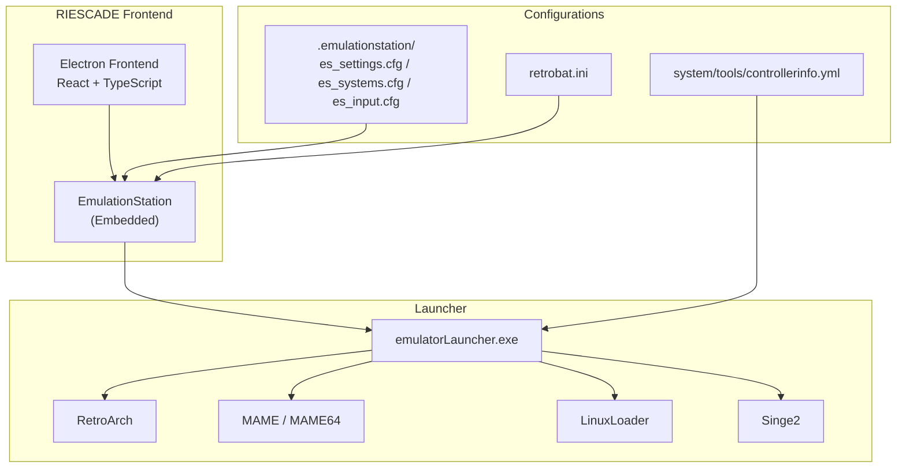
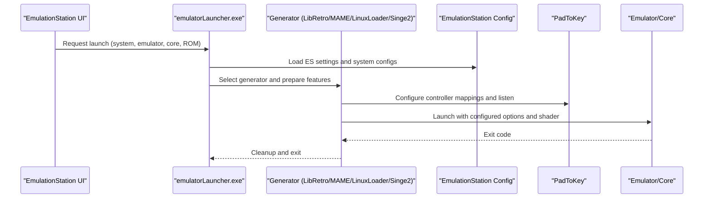
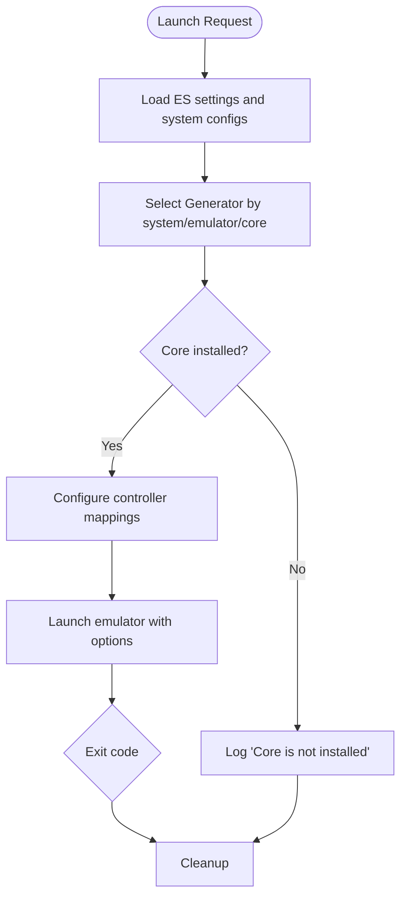
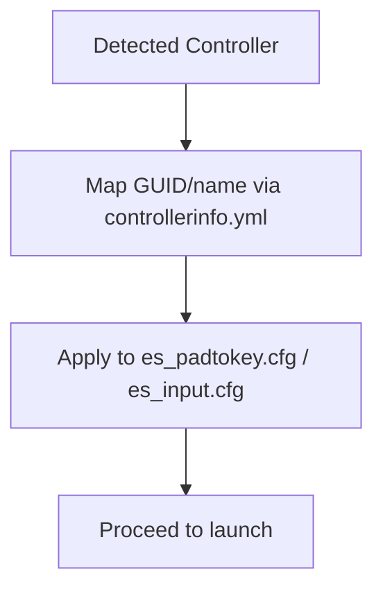
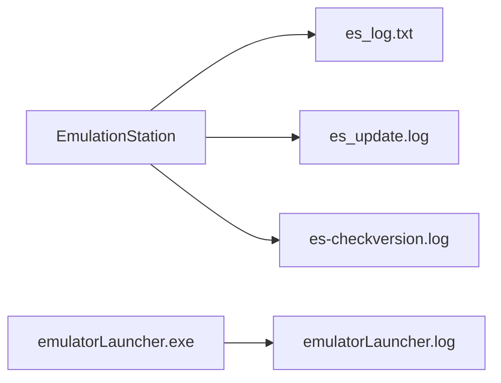
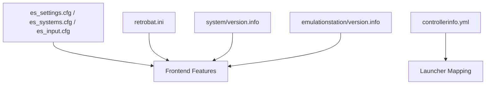

# Troubleshooting and FAQ

<cite>
**Referenced Files in This Document**
- [README.md](file://README.md)
- [retrobat.ini](file://retrobat.ini)
- [emulatorLauncher.log](file://emulationstation/emulatorLauncher.log)
- [controllerinfo.yml](file://system/tools/controllerinfo.yml)
- [es_log.txt](file://emulationstation/.emulationstation/es_log.txt)
- [es_padtokey.cfg](file://emulationstation/.emulationstation/es_padtokey.cfg)
- [es_settings.cfg](file://emulationstation/.emulationstation/es_settings.cfg)
- [es_systems.cfg](file://emulationstation/.emulationstation/es_systems.cfg)
- [es_input.cfg](file://emulationstation/.emulationstation/es_input.cfg)
- [es_update.log](file://emulationstation/es-update.log)
- [es-checkversion.log](file://emulationstation/es-checkversion.log)
- [version.info](file://system/version.info)
- [version.info](file://emulationstation/version.info)
</cite>

## Table of Contents
1. [Introduction](#introduction)
2. [Project Structure](#project-structure)
3. [Core Components](#core-components)
4. [Architecture Overview](#architecture-overview)
5. [Detailed Component Analysis](#detailed-component-analysis)
6. [Dependency Analysis](#dependency-analysis)
7. [Performance Considerations](#performance-considerations)
8. [Troubleshooting Guide](#troubbleshooting-guide)
9. [Conclusion](#conclusion)
10. [Appendices](#appendices)

## Introduction
This document provides comprehensive troubleshooting guidance for RIESCADE_SYSTEM, focusing on installation issues, emulator configuration errors, game library scanning failures, input device detection problems, logging diagnostics, update/download mechanisms, platform-specific Windows integration with EmulationStation/RetroBat, debugging techniques, and frequently asked questions. It consolidates actionable steps and diagnostic references from the repository’s configuration and log files.

## Project Structure
RIESCADE_SYSTEM integrates tightly with EmulationStation/RetroBat under the emulationstation directory. The frontend is Electron-based and relies on emulatorLauncher.exe to orchestrate launching of emulators and cores. Configuration files for EmulationStation and RetroBat live under .emulationstation, while system-level configuration and templates reside under system.

**Diagram sources**
- [README.md:34-44](file://README.md#L34-L44)
- [retrobat.ini:1-94](file://retrobat.ini#L1-L94)
- [emulatorLauncher.log:1-120](file://emulationstation/emulatorLauncher.log#L1-L120)

**Section sources**
- [README.md:1-44](file://README.md#L1-L44)
- [retrobat.ini:1-94](file://retrobat.ini#L1-L94)

## Core Components
- Electron Frontend and EmulationStation: The UI and game navigation are handled by the embedded EmulationStation, configured via es_settings.cfg and es_systems.cfg.
- emulatorLauncher.exe: Orchestrates emulator selection, core configuration, input remapping, and launch parameters. It reads ES settings and generates per-system configurations.
- RetroBat Global Settings: retrobat.ini controls interface behavior, fullscreen modes, vsync, monitors, and splash/video options.
- Input Mapping and Controller Resolution: controllerinfo.yml maps controller GUID/name to emulator-specific identifiers; es_padtokey.cfg and es_input.cfg manage controller bindings.
- Logging: emulatorLauncher.log captures launcher events and errors; es_log.txt holds EmulationStation logs; es_update.log and es-checkversion.log track updates.

**Section sources**
- [README.md:5-11](file://README.md#L5-L11)
- [retrobat.ini:50-94](file://retrobat.ini#L50-L94)
- [emulatorLauncher.log:1-120](file://emulationstation/emulatorLauncher.log#L1-L120)
- [controllerinfo.yml:1-119](file://system/tools/controllerinfo.yml#L1-L119)

## Architecture Overview
The launcher flow selects a generator based on system/emulator/core, prepares controller mappings, configures cores, and launches the emulator. Errors surface in emulatorLauncher.log and can be correlated with ES logs.

**Diagram sources**
- [emulatorLauncher.log:1-120](file://emulationstation/emulatorLauncher.log#L1-L120)
- [es_padtokey.cfg](file://emulationstation/.emulationstation/es_padtokey.cfg)

## Detailed Component Analysis

### EmulatorLauncher Workflow and Common Failures
- Core not installed: The launcher checks core availability and reports “Core is not installed” when a requested core is missing.
- Controller mapping: If no custom mapping is found, the launcher falls back to SDL/XInput detection; mismatches can cause input issues.
- Shader and log redirection: RetroArch is launched with a log file path; verify es_launch_stdout.log for emulator-side errors.

**Diagram sources**
- [emulatorLauncher.log:331-338](file://emulationstation/emulatorLauncher.log#L331-L338)

**Section sources**
- [emulatorLauncher.log:331-338](file://emulationstation/emulatorLauncher.log#L331-L338)

### Input Device Detection and Mapping
- GUID/name resolution: Use controllerinfo.yml to align RetroBat controller GUIDs/names with emulator-specific identifiers.
- PadToKey: es_padtokey.cfg is loaded during controller configuration; ensure it exists and matches expected devices.
- ES input: es_input.cfg defines global input bindings; mismatches here can conflict with emulator-side remaps.

**Diagram sources**
- [controllerinfo.yml:20-31](file://system/tools/controllerinfo.yml#L20-L31)
- [es_padtokey.cfg](file://emulationstation/.emulationstation/es_padtokey.cfg)
- [es_input.cfg](file://emulationstation/.emulationstation/es_input.cfg)

**Section sources**
- [controllerinfo.yml:1-119](file://system/tools/controllerinfo.yml#L1-L119)
- [emulatorLauncher.log:14-26](file://emulationstation/emulatorLauncher.log#L14-L26)

### Logging System and Diagnostics
- emulatorLauncher.log: Captures launcher lifecycle, controller detection, core configuration, and exit codes.
- es_log.txt: EmulationStation runtime logs; rotate and review for UI/system-level errors.
- es_update.log and es-checkversion.log: Track update and version checking activities.

**Diagram sources**
- [emulatorLauncher.log:1-120](file://emulationstation/emulatorLauncher.log#L1-L120)
- [es_log.txt](file://emulationstation/.emulationstation/es_log.txt)

**Section sources**
- [emulatorLauncher.log:1-120](file://emulationstation/emulatorLauncher.log#L1-L120)
- [es_log.txt](file://emulationstation/.emulationstation/es_log.txt)

## Dependency Analysis
RIESCADE_SYSTEM depends on:
- EmulationStation configuration files (.emulationstation/*)
- RetroBat global settings (retrobat.ini)
- Controller mapping templates (system/tools/controllerinfo.yml)
- Emulator cores and executables under emulators/
- Version metadata under system/version.info and emulationstation/version.info

**Diagram sources**
- [retrobat.ini:1-94](file://retrobat.ini#L1-L94)
- [controllerinfo.yml:1-119](file://system/tools/controllerinfo.yml#L1-L119)
- [version.info](file://system/version.info)
- [version.info](file://emulationstation/version.info)

**Section sources**
- [retrobat.ini:1-94](file://retrobat.ini#L1-L94)
- [controllerinfo.yml:1-119](file://system/tools/controllerinfo.yml#L1-L119)
- [version.info](file://system/version.info)
- [version.info](file://emulationstation/version.info)

## Performance Considerations
- VSync and fullscreen: retrobat.ini controls vsync and fullscreen behavior; disabling vsync may reduce stutter on some GPUs.
- Monitor selection: MonitorIndex determines which display hosts the interface.
- Shader and rendering: RetroArch is launched with a shader; heavy shaders can impact performance; adjust in launcher logs or emulator settings.
- Framerate overlay: DrawFramerate enables frame rate display in ES for quick diagnostics.

[No sources needed since this section provides general guidance]

## Troubleshooting Guide

### Installation Problems
- Missing dependencies or build artifacts:
  - Verify node/npm dependencies were installed using the recommended command in the repository’s README.
  - Confirm emulator binaries and cores exist under emulators/ and cores/ paths referenced by the launcher.
- Path resolution:
  - The frontend expects to be placed under the EmulationStation folder of RetroBat; ensure correct placement per repository guidance.

Step-by-step:
1. Reinstall dependencies using the documented command.
2. Confirm emulatorLauncher.exe and emulator binaries are present.
3. Validate ES settings and system configs exist under .emulationstation/.

**Section sources**
- [README.md:14-32](file://README.md#L14-L32)

### Emulator Configuration Errors
- Core not installed:
  - Symptom: “Core is not installed” error in emulatorLauncher.log.
  - Action: Install the required core for the selected emulator/system; re-run the launcher.
- Shader or log path issues:
  - RetroArch is launched with a log file path; check es_launch_stdout.log for emulator-side errors.

Step-by-step:
1. Review emulatorLauncher.log around the failing launch.
2. Verify the core DLL exists in the cores directory.
3. Check RetroArch log file path and permissions.

**Section sources**
- [emulatorLauncher.log:331-338](file://emulationstation/emulatorLauncher.log#L331-L338)

### Game Library Scanning Failures
- ES gamelist parsing:
  - RetroBat can limit gamelist parsing to existing files; if new ROMs do not appear, re-enable the relevant option and rescan.
- ROM path and naming:
  - Ensure ROMs are placed under the correct system folders and match expected naming conventions.

Step-by-step:
1. Open retrobat.ini and verify GameListOnly behavior.
2. Confirm ROMs are in the expected system subfolders.
3. Restart ES/RetroBat to rebuild gamelists.

**Section sources**
- [retrobat.ini:64-66](file://retrobat.ini#L64-L66)

### Input Device Detection Issues
- GUID/name mismatch:
  - Use controllerinfo.yml to map the detected GUID/name to the emulator’s expected identifier.
- Missing es_padtokey.cfg:
  - Ensure the file exists and contains expected mappings; the launcher logs loading it during controller configuration.
- ES input conflicts:
  - Check es_input.cfg for conflicting bindings that override emulator remaps.

Step-by-step:
1. Identify the controller GUID/name reported by the launcher.
2. Add/adjust entries in controllerinfo.yml for the target emulator.
3. Verify es_padtokey.cfg and es_input.cfg are present and consistent.

**Section sources**
- [controllerinfo.yml:20-31](file://system/tools/controllerinfo.yml#L20-L31)
- [emulatorLauncher.log:175-180](file://emulationstation/emulatorLauncher.log#L175-L180)
- [es_padtokey.cfg](file://emulationstation/.emulationstation/es_padtokey.cfg)
- [es_input.cfg](file://emulationstation/.emulationstation/es_input.cfg)

### Logging and Diagnostics
- Locate logs:
  - emulatorLauncher.log for launcher events and errors.
  - es_log.txt for EmulationStation runtime logs.
  - es_update.log and es-checkversion.log for update/version checks.
- Rotate and review:
  - es_log.txt rotates automatically; review the current file and recent rotated backups.

Step-by-step:
1. Reproduce the issue.
2. Check emulatorLauncher.log for the failing launch and stack traces.
3. Inspect es_log.txt for UI/system errors.
4. Review es_update.log and es-checkversion.log for update-related issues.

**Section sources**
- [emulatorLauncher.log:1-120](file://emulationstation/emulatorLauncher.log#L1-L120)
- [es_log.txt](file://emulationstation/.emulationstation/es_log.txt)

### Update and Download Mechanisms
- Update triggers:
  - The launcher logs show scheduled update store commands; ensure the option to scan installed store games is enabled if you expect automatic updates.
- Compatibility:
  - Compare system/version.info and emulationstation/version.info to confirm frontend and backend versions.

Step-by-step:
1. Enable store scanning in retrobat.ini if desired.
2. Monitor es_update.log and es-checkversion.log for update activity.
3. Verify versions in version.info files.

**Section sources**
- [emulatorLauncher.log:28-34](file://emulationstation/emulatorLauncher.log#L28-L34)
- [retrobat.ini:8-10](file://retrobat.ini#L8-L10)
- [version.info](file://system/version.info)
- [version.info](file://emulationstation/version.info)

### Platform-Specific Windows Integration
- Fullscreen and vsync:
  - Adjust Fullscreen, FullscreenBorderless, ForceFullscreenRes, VSync, and FocusDelay in retrobat.ini to match Windows behavior.
- Monitor targeting:
  - Use MonitorIndex to select the correct display.
- Splash/video:
  - Configure splash screen behavior and delays in the SplashScreen section of retrobat.ini.

Step-by-step:
1. Set Fullscreen and VSync according to GPU compatibility.
2. Set MonitorIndex to the intended display.
3. Tune VideoDelay and related splash options as needed.

**Section sources**
- [retrobat.ini:50-94](file://retrobat.ini#L50-L94)

### Debugging Tools and Techniques
- Correlate launcher and emulator logs:
  - Match timestamps in emulatorLauncher.log with RetroArch log output.
- Controller debugging:
  - Use controllerinfo.yml to resolve GUID/name discrepancies; verify es_padtokey.cfg and es_input.cfg.
- Shader and rendering:
  - Temporarily remove or change the shader parameter in launcher logs to isolate rendering issues.

**Section sources**
- [emulatorLauncher.log:1-120](file://emulationstation/emulatorLauncher.log#L1-L120)
- [controllerinfo.yml:1-119](file://system/tools/controllerinfo.yml#L1-L119)

### Frequently Asked Questions

Q1: What are the system requirements?
- The project is built with Electron, React, and TypeScript; ensure Node.js/npm are available for development and production builds.

Q2: Why do some cores fail to launch?
- The launcher validates core presence; install the required core DLLs for the selected emulator/system.

Q3: How do I fix input not working in certain emulators?
- Align controller GUID/name via controllerinfo.yml and ensure es_padtokey.cfg and es_input.cfg are present.

Q4: How do I enable fullscreen or borderless mode?
- Modify Fullscreen and FullscreenBorderless in retrobat.ini.

Q5: How do I troubleshoot update/download issues?
- Review es_update.log and es-checkversion.log; ensure store scanning is enabled in retrobat.ini.

Q6: How do I recover from configuration corruption?
- Restore es_settings.cfg, es_systems.cfg, and es_input.cfg from backups or defaults; keep es_log.txt.bak for rollback.

**Section sources**
- [README.md:14-32](file://README.md#L14-L32)
- [retrobat.ini:50-94](file://retrobat.ini#L50-L94)
- [emulatorLauncher.log:331-338](file://emulationstation/emulatorLauncher.log#L331-L338)
- [es_log.txt](file://emulationstation/.emulationstation/es_log.txt)

## Conclusion
RIESCADE_SYSTEM integrates tightly with EmulationStation/RetroBat and leverages emulatorLauncher.exe for robust emulator orchestration. Most issues can be resolved by validating core availability, aligning controller mappings via controllerinfo.yml, reviewing emulatorLauncher.log and es_log.txt, and tuning retrobat.ini for platform-specific behavior. Updates and downloads are tracked via dedicated log files, and version.info confirms compatibility across components.

[No sources needed since this section summarizes without analyzing specific files]

## Appendices

### Backup and Recovery Procedures
- Configuration files to back up:
  - es_settings.cfg, es_systems.cfg, es_input.cfg, es_padtokey.cfg, retrobat.ini.
- Logs to preserve:
  - es_log.txt and its backup (es_log.txt.bak).
- Steps:
  - Copy these files before major updates.
  - Restore from backups if a configuration change causes issues.

**Section sources**
- [es_log.txt](file://emulationstation/.emulationstation/es_log.txt)
- [es_padtokey.cfg](file://emulationstation/.emulationstation/es_padtokey.cfg)
- [es_settings.cfg](file://emulationstation/.emulationstation/es_settings.cfg)
- [es_systems.cfg](file://emulationstation/.emulationstation/es_systems.cfg)
- [es_input.cfg](file://emulationstation/.emulationstation/es_input.cfg)