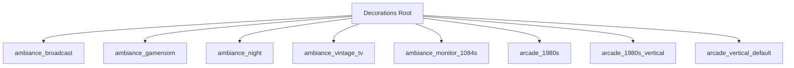
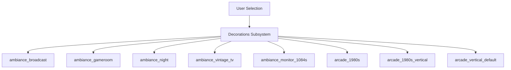
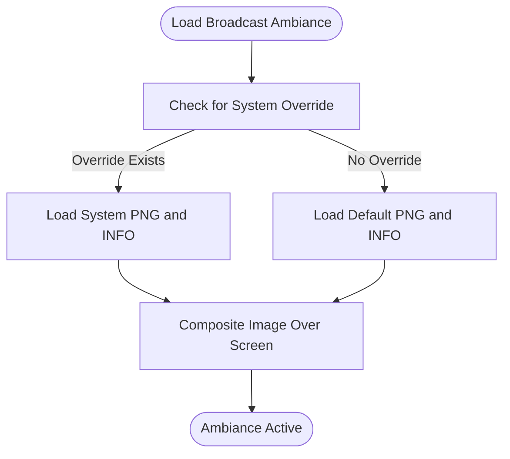
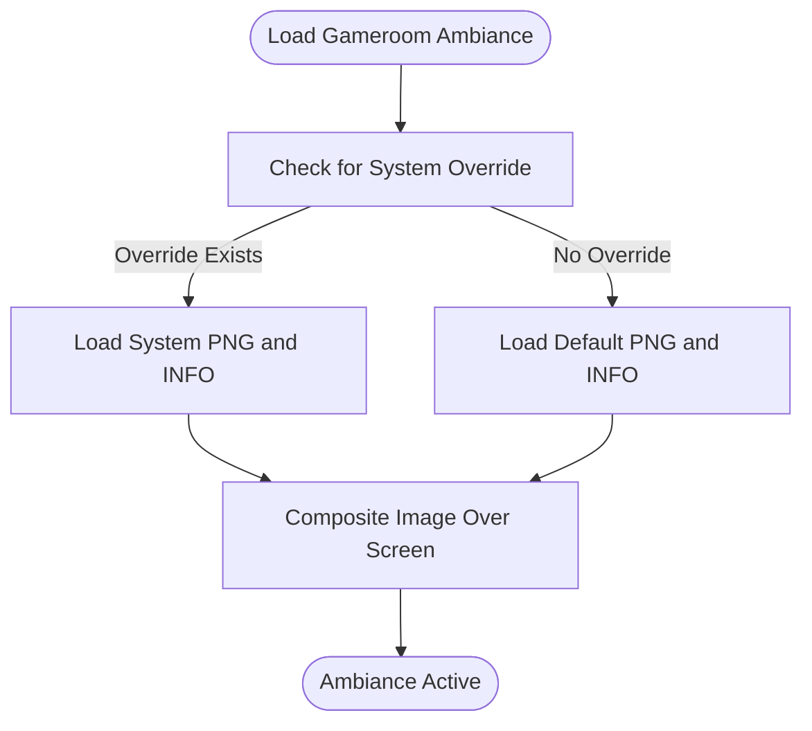
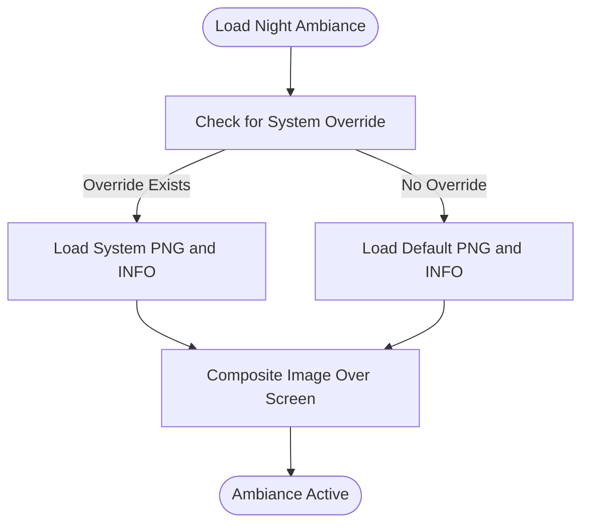
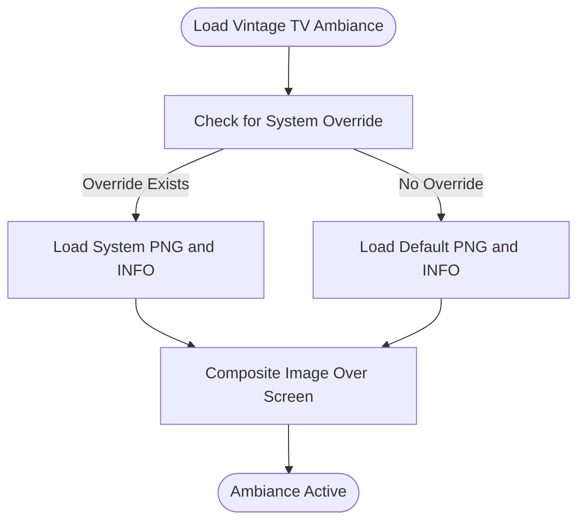
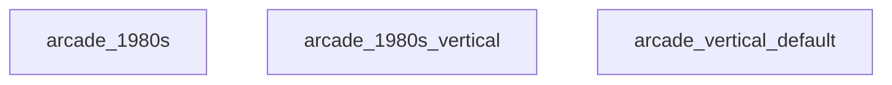
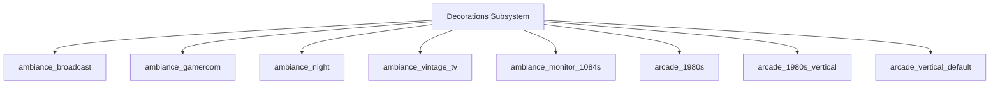

# Ambiance Settings

<cite>
**Referenced Files in This Document**
- [README.md](file://system/decorations/README.md)
- [default.info (ambiance_gameroom)](file://system/decorations/ambiance_gameroom/default.info)
- [default.info (ambiance_night)](file://system/decorations/ambiance_night/default.info)
- [default.info (ambiance_vintage_tv)](file://system/decorations/ambiance_vintage_tv/default.info)
- [default.png (ambiance_broadcast)](file://system/decorations/ambiance_broadcast/default.png)
- [default.png (ambiance_gameroom)](file://system/decorations/ambiance_gameroom/default.png)
- [default.png (ambiance_night)](file://system/decorations/ambiance_night/default.png)
- [default.png (ambiance_vintage_tv)](file://system/decorations/ambiance_vintage_tv/default.png)
- [systems/3ds.info (ambiance_broadcast)](file://system/decorations/ambiance_broadcast/systems/3ds.info)
- [systems/3ds.png (ambiance_broadcast)](file://system/decorations/ambiance_broadcast/systems/3ds.png)
- [systems/3ds.info (ambiance_gameroom)](file://system/decorations/ambiance_gameroom/systems/3ds.info)
- [systems/3ds.png (ambiance_gameroom)](file://system/decorations/ambiance_gameroom/systems/3ds.png)
- [systems/3ds.info (ambiance_night)](file://system/decorations/ambiance_night/systems/3ds.info)
- [systems/3ds.png (ambiance_night)](file://system/decorations/ambiance_night/systems/3ds.png)
- [systems/3ds.info (ambiance_vintage_tv)](file://system/decorations/ambiance_vintage_tv/systems/3ds.info)
- [systems/3ds.png (ambiance_vintage_tv)](file://system/decorations/ambiance_vintage_tv/systems/3ds.png)
</cite>

## Table of Contents
1. [Introduction](#introduction)
2. [Project Structure](#project-structure)
3. [Core Components](#core-components)
4. [Architecture Overview](#architecture-overview)
5. [Detailed Component Analysis](#detailed-component-analysis)
6. [Dependency Analysis](#dependency-analysis)
7. [Performance Considerations](#performance-considerations)
8. [Troubleshooting Guide](#troubleshooting-guide)
9. [Conclusion](#conclusion)

## Introduction
This document explains ambiance settings and environmental effects in the system, focusing on the ambiance modes available under the decorations subsystem. It covers the broadcast, gameroom, night, vintage TV, and arcade environments, detailing how ambiance assets are organized, configured, and integrated into the visual theme. Practical guidance is provided for selecting ambiance effects aligned with gaming systems and user preferences, along with performance considerations for smooth gameplay.

## Project Structure
Ambiance settings are part of the decorations subsystem. Each ambiance mode is represented by a dedicated folder containing:
- A default image asset (PNG) used as the base ambiance backdrop
- A default configuration file (INFO) defining layout and opacity parameters
- Optional per-system overrides stored under a systems subfolder

Key ambiance folders:
- ambiance_broadcast
- ambiance_gameroom
- ambiance_night
- ambiance_vintage_tv
- ambiance_monitor_1084s
- arcade_1980s
- arcade_1980s_vertical
- arcade_vertical_default

Per-system overrides follow the same pattern, with system-specific PNG and INFO files.

**Section sources**
- [README.md:1-10](file://system/decorations/README.md#L1-L10)

## Core Components
Ambiance modes are composed of:
- Visual backdrop image (PNG): Provides the primary atmospheric texture
- Layout configuration (INFO): Defines margins, opacity, and optional message positioning

Each ambiance mode includes:
- A default.INFO with standardized layout parameters
- A default.PNG serving as the fallback ambiance asset
- Optional per-system overrides under a systems subfolder

Practical implications:
- The INFO file controls how the ambiance image is positioned and blended over the screen
- Per-system overrides allow tailoring ambiance visuals to match specific hardware or software themes

**Section sources**
- [default.info (ambiance_gameroom):1-11](file://system/decorations/ambiance_gameroom/default.info#L1-L11)
- [default.info (ambiance_night):1-11](file://system/decorations/ambiance_night/default.info#L1-L11)
- [default.info (ambiance_vintage_tv):1-11](file://system/decorations/ambiance_vintage_tv/default.info#L1-L11)
- [default.png (ambiance_broadcast)](file://system/decorations/ambiance_broadcast/default.png)
- [default.png (ambiance_gameroom)](file://system/decorations/ambiance_gameroom/default.png)
- [default.png (ambiance_night)](file://system/decorations/ambiance_night/default.png)
- [default.png (ambiance_vintage_tv)](file://system/decorations/ambiance_vintage_tv/default.png)

## Architecture Overview
Ambiance selection and rendering follow a simple, layered architecture:
- Decorations subsystem exposes ambiance modes as selectable options
- For each mode, the system loads the default.INFO and default.PNG
- Per-system overrides (if present) supersede defaults for specific systems
- Rendering composites the ambiance image onto the screen according to layout parameters

**Section sources**
- [README.md:1-10](file://system/decorations/README.md#L1-L10)

## Detailed Component Analysis

### Broadcast Ambiance
Broadcast ambiance provides a dynamic, energetic atmosphere suitable for modern or lively gaming sessions. It includes:
- Visual asset: default.PNG
- Layout parameters: width, height, top, left, bottom, right, opacity, and message coordinates

System-specific overrides:
- Systems subfolder contains per-system PNG and INFO files for customization

**Section sources**
- [default.png (ambiance_broadcast)](file://system/decorations/ambiance_broadcast/default.png)
- [systems/3ds.png (ambiance_broadcast)](file://system/decorations/ambiance_broadcast/systems/3ds.png)
- [systems/3ds.info (ambiance_broadcast)](file://system/decorations/ambiance_broadcast/systems/3ds.info)

### Gameroom Ambiance
Gameroom ambiance creates a cozy, traditional gaming atmosphere. It includes:
- Visual asset: default.PNG
- Layout parameters: width, height, top, left, bottom, right, opacity, and message coordinates

System-specific overrides:
- Systems subfolder contains per-system PNG and INFO files for customization

**Section sources**
- [default.info (ambiance_gameroom):1-11](file://system/decorations/ambiance_gameroom/default.info#L1-L11)
- [default.png (ambiance_gameroom)](file://system/decorations/ambiance_gameroom/default.png)
- [systems/3ds.png (ambiance_gameroom)](file://system/decorations/ambiance_gameroom/systems/3ds.png)
- [systems/3ds.info (ambiance_gameroom)](file://system/decorations/ambiance_gameroom/systems/3ds.info)

### Night Ambiance
Night ambiance offers a dark, immersive environment ideal for late-night sessions. It includes:
- Visual asset: default.PNG
- Layout parameters: width, height, top, left, bottom, right, opacity, and message coordinates

System-specific overrides:
- Systems subfolder contains per-system PNG and INFO files for customization

**Section sources**
- [default.info (ambiance_night):1-11](file://system/decorations/ambiance_night/default.info#L1-L11)
- [default.png (ambiance_night)](file://system/decorations/ambiance_night/default.png)
- [systems/3ds.png (ambiance_night)](file://system/decorations/ambiance_night/systems/3ds.png)
- [systems/3ds.info (ambiance_night)](file://system/decorations/ambiance_night/systems/3ds.info)

### Vintage TV Ambiance
Vintage TV ambiance evokes retro CRT aesthetics with nostalgic textures. It includes:
- Visual asset: default.PNG
- Layout parameters: width, height, top, left, bottom, right, opacity, and message coordinates

System-specific overrides:
- Systems subfolder contains per-system PNG and INFO files for customization

**Section sources**
- [default.info (ambiance_vintage_tv):1-11](file://system/decorations/ambiance_vintage_tv/default.info#L1-L11)
- [default.png (ambiance_vintage_tv)](file://system/decorations/ambiance_vintage_tv/default.png)
- [systems/3ds.png (ambiance_vintage_tv)](file://system/decorations/ambiance_vintage_tv/systems/3ds.png)
- [systems/3ds.info (ambiance_vintage_tv)](file://system/decorations/ambiance_vintage_tv/systems/3ds.info)

### Arcade Environments
Additional ambiance categories include:
- arcade_1980s
- arcade_1980s_vertical
- arcade_vertical_default

These modes align ambiance visuals with classic arcade aesthetics and orientations, following the same default.INFO and default.PNG pattern with optional per-system overrides.

[No sources needed since this section doesn't analyze specific files]

## Dependency Analysis
Ambiance modes depend on:
- Decorations subsystem for discovery and selection
- Per-mode default.INFO and default.PNG for rendering parameters and visuals
- Optional per-system overrides for system-specific customization

**Section sources**
- [README.md:1-10](file://system/decorations/README.md#L1-L10)

## Performance Considerations
- Prefer default.INFO values optimized for target resolution to minimize scaling overhead
- Limit simultaneous visual overlays to maintain frame stability
- Use per-system overrides judiciously; excessive custom assets can increase memory usage
- Test ambiance modes across different GPUs and drivers to ensure consistent performance
- Disable or simplify ambiance during performance-critical scenarios

[No sources needed since this section provides general guidance]

## Troubleshooting Guide
- If an ambiance appears misaligned or clipped, adjust top, left, bottom, and right values in the INFO file
- If the ambiance is too dim or too bright, tweak opacity to balance with game visuals
- If a system-specific override causes issues, temporarily remove or rename the override files to fall back to default
- Verify that default.PNG exists for the chosen ambiance mode; missing assets will prevent rendering

**Section sources**
- [default.info (ambiance_gameroom):1-11](file://system/decorations/ambiance_gameroom/default.info#L1-L11)
- [default.info (ambiance_night):1-11](file://system/decorations/ambiance_night/default.info#L1-L11)
- [default.info (ambiance_vintage_tv):1-11](file://system/decorations/ambiance_vintage_tv/default.info#L1-L11)

## Conclusion
Ambiance settings provide a flexible way to tailor the visual environment around gameplay. By leveraging default.INFO and default.PNG assets and optionally adding per-system overrides, users can select atmospheres that enhance immersion and match their preferences. Proper configuration ensures smooth performance while delivering a cohesive visual theme across systems.