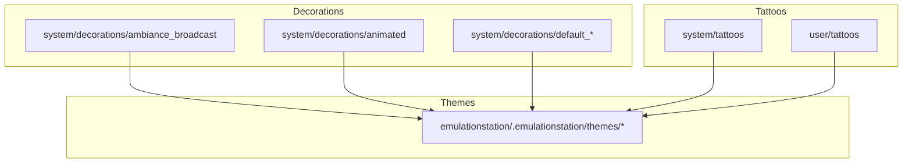
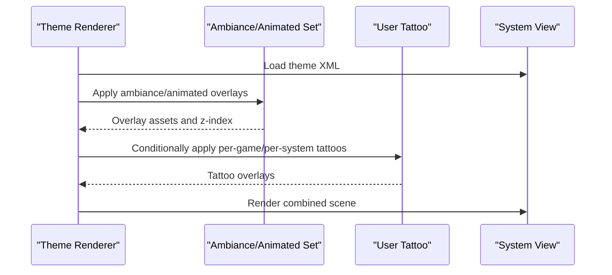
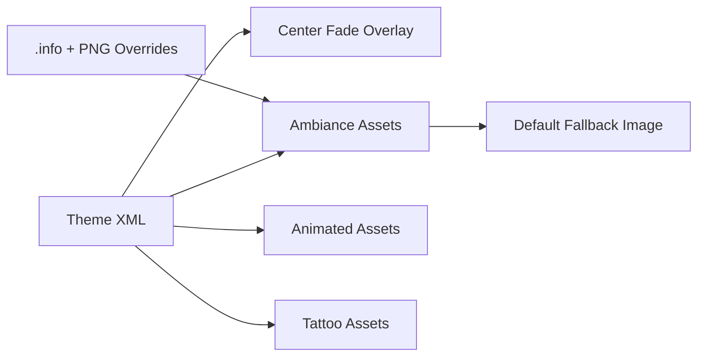

# Decoration System

<cite>
**Referenced Files in This Document**
- [README.md](file://system/decorations/README.md)
- [README.md](file://user/tattoos/README.md)
- [README.md](file://system/templates/user/tattoos/README.md)
- [README.md](file://system/tattoos/README.md)
- [3ds.info](file://system/decorations/ambiance_broadcast/systems/3ds.info)
- [default.png](file://system/decorations/ambiance_broadcast/default.png)
- [horizontaldark.xml](file://emulationstation/.emulationstation/themes/es-theme-carbon/subsets/systemview/horizontaldark.xml)
</cite>

## Table of Contents
1. [Introduction](#introduction)
2. [Project Structure](#project-structure)
3. [Core Components](#core-components)
4. [Architecture Overview](#architecture-overview)
5. [Detailed Component Analysis](#detailed-component-analysis)
6. [Dependency Analysis](#dependency-analysis)
7. [Performance Considerations](#performance-considerations)
8. [Troubleshooting Guide](#troubleshooting-guide)
9. [Conclusion](#conclusion)
10. [Appendices](#appendices)

## Introduction
This document describes the decoration system used by the application, focusing on ambiance effects, animated decorations, and user customization via tattoos. It explains the decoration file formats, configuration structures, placement mechanisms, and how they integrate with themes. Practical examples illustrate how to configure decorations, create custom decorations, and troubleshoot common display issues. Compatibility across screen resolutions and performance impact are addressed to ensure smooth operation on diverse setups.

## Project Structure
The decoration system is organized under dedicated directories:
- Decorations: ambiance sets, animated decorations, and default bezel sets
- Tattoos: user-defined personalization overlays
- Themes: UI integration points for decorations and overlays

Key locations:
- system/decorations: Official decoration sets and fallbacks
- system/tattoos: Default tattoo assets
- user/tattoos: User-created tattoos
- emulationstation/.emulationstation/themes: Theme XML files that reference overlays and center fades

**Diagram sources**
- [README.md:1-10](file://system/decorations/README.md#L1-L10)
- [README.md:1-11](file://system/tattoos/README.md#L1-L11)
- [README.md:1-11](file://user/tattoos/README.md#L1-L11)

**Section sources**
- [README.md:1-10](file://system/decorations/README.md#L1-L10)

## Core Components
- Ambiance sets: Predefined decorative themes such as broadcast, gameroom, night mode, vintage TV, and monitor variants. Each set contains a default fallback image and per-system overrides.
- Animated decorations: Dynamic visual effects packaged as sets with system-specific configurations.
- Tattoos: Personalized overlays placed per-game or per-system, displayed when bezels are enabled.
- Theme integration: Theme XML files define overlay positions, sizes, and z-index for center fades and other visual elements.

Key configuration and asset files:
- Ambiance broadcast set includes a default PNG and per-system .info and PNG files.
- Tattoo system supports per-game and per-system PNG assets.
- Theme XML references center fade overlays and related UI elements.

**Section sources**
- [README.md:1-10](file://system/decorations/README.md#L1-L10)
- [README.md:1-11](file://user/tattoos/README.md#L1-L11)
- [README.md:1-11](file://system/templates/user/tattoos/README.md#L1-L11)
- [3ds.info:1-1](file://system/decorations/ambiance_broadcast/systems/3ds.info#L1-L1)
- [default.png](file://system/decorations/ambiance_broadcast/default.png)
- [horizontaldark.xml:117-133](file://emulationstation/.emulationstation/themes/es-theme-carbon/subsets/systemview/horizontaldark.xml#L117-L133)

## Architecture Overview
The decoration pipeline integrates theme rendering with decoration assets and tattoos:
- Theme XML defines UI regions and overlay layers.
- Ambiance and animated sets provide background and dynamic overlays.
- Tattoos augment visuals when enabled and applicable.
- Asset resolution and scaling are handled by the theme renderer to maintain compatibility across screen resolutions.

**Diagram sources**
- [horizontaldark.xml:117-133](file://emulationstation/.emulationstation/themes/es-theme-carbon/subsets/systemview/horizontaldark.xml#L117-L133)
- [README.md:1-10](file://system/decorations/README.md#L1-L10)
- [README.md:1-11](file://user/tattoos/README.md#L1-L11)

## Detailed Component Analysis

### Ambiance Effects
Ambiance sets provide thematic backgrounds and optional per-system overrides. The broadcast ambiance set demonstrates the structure:
- Default fallback image for broad compatibility
- Per-system .info and PNG files for system-specific visuals

Placement mechanism:
- Each system override references a .info file pointing to a system-specific asset.
- The default ambiance image serves as a fallback when no system-specific asset exists.

Practical example:
- To customize the 3DS ambiance, place a PNG named after the system and a corresponding .info file in the ambiance broadcast systems directory.

**Section sources**
- [README.md:1-10](file://system/decorations/README.md#L1-L10)
- [3ds.info:1-1](file://system/decorations/ambiance_broadcast/systems/3ds.info#L1-L1)
- [default.png](file://system/decorations/ambiance_broadcast/default.png)

### Animated Decorations
Animated decorations deliver dynamic visual effects. While the directory structure indicates presence, the specific animation formats and configuration files are not detailed in the provided context. Integration follows the same pattern as ambiance sets: assets are placed under the animated directory and referenced by the theme renderer.

Integration points:
- Theme XML can reference animated overlays similarly to static overlays.
- Animation timing and sequencing are managed by the theme renderer.

**Section sources**
- [README.md:1-10](file://system/decorations/README.md#L1-L10)

### Tattoo System
The tattoo system enables personalized game decorations:
- Per-game tattoos: Place a PNG named after the ROM file inside a system-specific subfolder under the user tattoos directory.
- Per-system tattoos: Place a PNG named after the system inside the default tattoos directory.
- Tattoos are only shown when bezels are enabled.

User customization workflow:
- Add PNG assets to user/tattoos/games/<system>/<rom_name>.png for per-game tattoos.
- Add PNG assets to user/tattoos/default/<system>.png for per-system tattoos.

Default tattoos:
- system/tattoos provides default assets for reference and baseline behavior.

**Section sources**
- [README.md:1-11](file://user/tattoos/README.md#L1-L11)
- [README.md:1-11](file://system/templates/user/tattoos/README.md#L1-L11)
- [README.md:1-11](file://system/tattoos/README.md#L1-L11)

### Theme Integration
Themes define UI regions where overlays are rendered:
- Center fade overlays and other visual elements are configured via theme XML.
- Example: horizontaldark.xml includes a center fade image with positioning, sizing, color tint, and z-index.

Integration steps:
- Reference overlay assets in theme XML.
- Position overlays relative to the UI layout.
- Adjust z-index to layer overlays correctly behind or in front of UI elements.

**Section sources**
- [horizontaldark.xml:117-133](file://emulationstation/.emulationstation/themes/es-theme-carbon/subsets/systemview/horizontaldark.xml#L117-L133)

## Dependency Analysis
The decoration system relies on:
- Theme XML for overlay positioning and layering
- Decoration assets for ambiance and animated effects
- Tattoo assets for personalization
- Fallback mechanisms to ensure visuals remain consistent across systems

**Diagram sources**
- [horizontaldark.xml:117-133](file://emulationstation/.emulationstation/themes/es-theme-carbon/subsets/systemview/horizontaldark.xml#L117-L133)
- [3ds.info:1-1](file://system/decorations/ambiance_broadcast/systems/3ds.info#L1-L1)
- [default.png](file://system/decorations/ambiance_broadcast/default.png)

**Section sources**
- [README.md:1-10](file://system/decorations/README.md#L1-L10)
- [horizontaldark.xml:117-133](file://emulationstation/.emulationstation/themes/es-theme-carbon/subsets/systemview/horizontaldark.xml#L117-L133)

## Performance Considerations
- Texture memory: Large PNG assets increase GPU memory usage. Prefer optimized PNGs and appropriate resolutions aligned with the target display.
- Layering: Excessive z-index layers and overlapping overlays can impact rendering performance. Keep overlay counts reasonable.
- Resolution scaling: Theme renderers typically handle scaling; ensure assets match intended resolutions to avoid upscaling artifacts.
- Animated effects: Smooth animation depends on frame pacing and shader performance. Limit the number of simultaneous animations.

## Troubleshooting Guide
Common issues and resolutions:
- No visible tattoos:
  - Verify bezels are enabled in the UI.
  - Confirm tattoo filenames match ROM or system names exactly.
  - Ensure tattoos are placed in the correct subfolders under user/tattoos.
- Missing ambiance for a system:
  - Check for a system-specific .info and PNG in the ambiance systems directory.
  - Confirm the .info file points to a valid asset path.
  - Validate that the default fallback image is present.
- Overlays appear behind or in front of UI elements:
  - Adjust z-index values in the theme XML.
  - Reorder overlay definitions to achieve desired layering.
- Artifacts or blurriness:
  - Use assets sized to the target resolution.
  - Avoid excessive scaling by theme renderers.

**Section sources**
- [README.md:1-11](file://user/tattoos/README.md#L1-L11)
- [3ds.info:1-1](file://system/decorations/ambiance_broadcast/systems/3ds.info#L1-L1)
- [default.png](file://system/decorations/ambiance_broadcast/default.png)
- [horizontaldark.xml:117-133](file://emulationstation/.emulationstation/themes/es-theme-carbon/subsets/systemview/horizontaldark.xml#L117-L133)

## Conclusion
The decoration system combines ambiance sets, animated effects, and user tattoos to create immersive visual experiences. By understanding asset placement, configuration structures, and theme integration, users can tailor their interface while maintaining performance and compatibility across screens. Following the guidelines and troubleshooting tips ensures reliable and visually appealing results.

## Appendices
- Supported ambiance categories:
  - Broadcast
  - Gameroom
  - Night mode
  - Vintage TV
  - Monitor variants
- Tattoo naming conventions:
  - Per-game: <rom_name>.png in user/tattoos/games/<system>/
  - Per-system: <system>.png in user/tattoos/default/