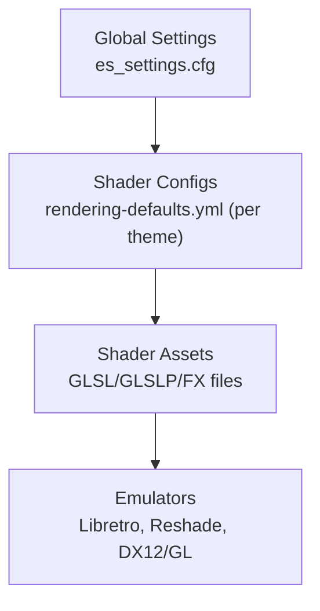
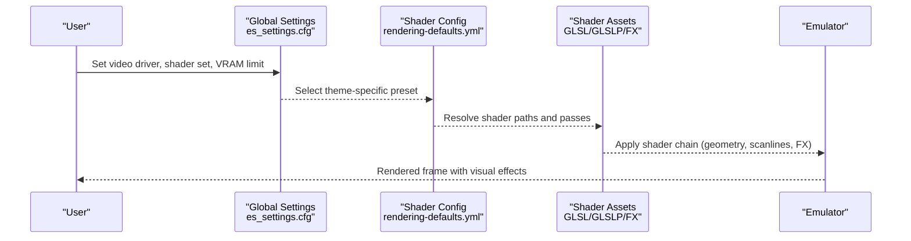
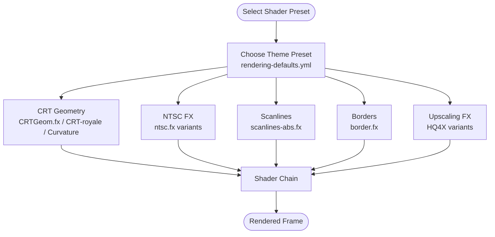
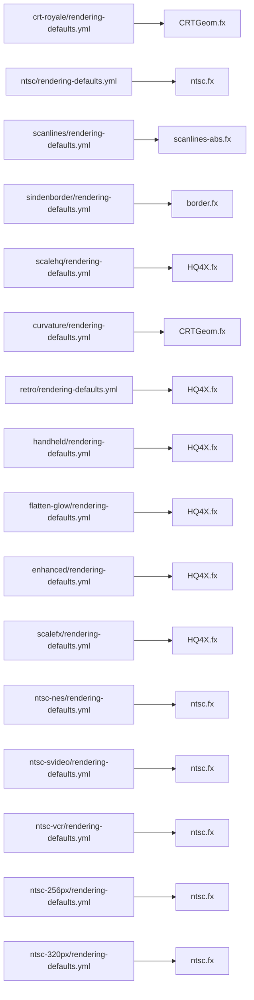

# Performance Optimization

<cite>
**Referenced Files in This Document**
- [es_settings.cfg](file://emulationstation/.emulationstation/es_settings.cfg)
- [rendering-defaults.yml](file://system/shaders/configs/[riescade]/rendering-defaults.yml)
- [rendering-defaults.yml](file://system/shaders/configs/crt-royale/rendering-defaults.yml)
- [rendering-defaults.yml](file://system/shaders/configs/ntsc/rendering-defaults.yml)
- [rendering-defaults.yml](file://system/shaders/configs/curvature/rendering-defaults.yml)
- [rendering-defaults.yml](file://system/shaders/configs/scalehq/rendering-defaults.yml)
- [rendering-defaults.yml](file://system/shaders/configs/scanlines/rendering-defaults.yml)
- [rendering-defaults.yml](file://system/shaders/configs/retro/rendering-defaults.yml)
- [rendering-defaults.yml](file://system/shaders/configs/handheld/rendering-defaults.yml)
- [rendering-defaults.yml](file://system/shaders/configs/flatten-glow/rendering-defaults.yml)
- [rendering-defaults.yml](file://system/shaders/configs/enhanced/rendering-defaults.yml)
- [rendering-defaults.yml](file://system/shaders/configs/scalefx/rendering-defaults.yml)
- [rendering-defaults.yml](file://system/shaders/configs/ntsc-nes/rendering-defaults.yml)
- [rendering-defaults.yml](file://system/shaders/configs/ntsc-svideo/rendering-defaults.yml)
- [rendering-defaults.yml](file://system/shaders/configs/ntsc-vcr/rendering-defaults.yml)
- [rendering-defaults.yml](file://system/shaders/configs/ntsc-256px/rendering-defaults.yml)
- [rendering-defaults.yml](file://system/shaders/configs/ntsc-320px/rendering-defaults.yml)
- [rendering-defaults.yml](file://system/shaders/configs/sindenborder/rendering-defaults.yml)
- [rendering-defaults.yml](file://system/shaders/configs/tvout/rendering-defaults.yml)
- [rendering-defaults.yml](file://system/shaders/configs/tvout-interlacing/rendering-defaults.yml)
- [rendering-defaults.yml](file://system/shaders/configs/vhs/rendering-defaults.yml)
- [rendering-defaults.yml](file://system/shaders/configs/xbrz-5x/rendering-defaults.yml)
- [rendering-defaults.yml](file://system/shaders/configs/zfast/CRTGeom.fx)
- [rendering-defaults.yml](file://system/shaders/configs/zfast/CRTEasymode.fx)
- [rendering-defaults.yml](file://system/shaders/configs/crt-new-pixie/CRTGeom.fx)
- [rendering-defaults.yml](file://system/shaders/configs/crt-royale/CRTGeom.fx)
- [rendering-defaults.yml](file://system/shaders/configs/curvature/CRTGeom.fx)
- [rendering-defaults.yml](file://system/shaders/configs/scanlines/scanlines-abs.fx)
- [rendering-defaults.yml](file://system/shaders/configs/ntsc/ntsc.fx)
- [rendering-defaults.yml](file://system/shaders/configs/ntsc-nes/ntsc.fx)
- [rendering-defaults.yml](file://system/shaders/configs/ntsc-svideo/ntsc.fx)
- [rendering-defaults.yml](file://system/shaders/configs/ntsc-vcr/ntsc.fx)
- [rendering-defaults.yml](file://system/shaders/configs/ntsc-256px/ntsc.fx)
- [rendering-defaults.yml](file://system/shaders/configs/ntsc-320px/ntsc.fx)
- [rendering-defaults.yml](file://system/shaders/configs/scalefx/scalefx-hybrid/HQ4X.fx)
- [rendering-defaults.yml](file://system/shaders/configs/scalefx/scalefx-aa/HQ4X.fx)
- [rendering-defaults.yml](file://system/shaders/configs/scalefx/scalefx/HQ4X.fx)
- [rendering-defaults.yml](file://system/shaders/configs/scalehq/HQ4X.fx)
- [rendering-defaults.yml](file://system/shaders/configs/enhanced/HQ4X.fx)
- [rendering-defaults.yml](file://system/shaders/configs/xbrz-5x/HQ4X.fx)
- [rendering-defaults.yml](file://system/shaders/configs/flatten-glow/HQ4X.fx)
- [rendering-defaults.yml](file://system/shaders/configs/handheld/HQ4X.fx)
- [rendering-defaults.yml](file://system/shaders/configs/retro/HQ4X.fx)
- [rendering-defaults.yml](file://system/shaders/configs/scalefx/scalefx-hybrid/scanlines-abs.fx)
- [rendering-defaults.yml](file://system/shaders/configs/scalefx/scalefx-aa/scanlines-abs.fx)
- [rendering-defaults.yml](file://system/shaders/configs/scalefx/scalefx/scanlines-abs.fx)
- [rendering-defaults.yml](file://system/shaders/configs/scanlines/scanlines-abs.fx)
- [rendering-defaults.yml](file://system/shaders/configs/curvature/scanlines-abs.fx)
- [rendering-defaults.yml](file://system/shaders/configs/crt-new-pixie/scanlines-abs.fx)
- [rendering-defaults.yml](file://system/shaders/configs/crt-royale/scanlines-abs.fx)
- [rendering-defaults.yml](file://system/shaders/configs/ntsc/scanlines-abs.fx)
- [rendering-defaults.yml](file://system/shaders/configs/ntsc-nes/scanlines-abs.fx)
- [rendering-defaults.yml](file://system/shaders/configs/ntsc-svideo/scanlines-abs.fx)
- [rendering-defaults.yml](file://system/shaders/configs/ntsc-vcr/scanlines-abs.fx)
- [rendering-defaults.yml](file://system/shaders/configs/ntsc-256px/scanlines-abs.fx)
- [rendering-defaults.yml](file://system/shaders/configs/ntsc-320px/scanlines-abs.fx)
- [rendering-defaults.yml](file://system/shaders/configs/tvout/scanlines-abs.fx)
- [rendering-defaults.yml](file://system/shaders/configs/tvout-interlacing/scanlines-abs.fx)
- [rendering-defaults.yml](file://system/shaders/configs/vhs/scanlines-abs.fx)
- [rendering-defaults.yml](file://system/shaders/configs/sindenborder/border.fx)
- [rendering-defaults.yml](file://system/shaders/configs/scalefx/scalefx-hybrid/border.fx)
- [rendering-defaults.yml](file://system/shaders/configs/scalefx/scalefx-aa/border.fx)
- [rendering-defaults.yml](file://system/shaders/configs/scalefx/scalefx/border.fx)
- [rendering-defaults.yml](file://system/shaders/configs/sindenborder/border.fx)
- [rendering-defaults.yml](file://system/shaders/configs/tvout/border.fx)
- [rendering-defaults.yml](file://system/shaders/configs/tvout-interlacing/border.fx)
- [rendering-defaults.yml](file://system/shaders/configs/vhs/border.fx)
- [rendering-defaults.yml](file://system/shaders/configs/technicolor/rendering-defaults.yml)
- [rendering-defaults.yml](file://system/shaders/configs/technicolor/scanlines-abs.fx)
- [rendering-defaults.yml](file://system/shaders/configs/technicolor/border.fx)
- [rendering-defaults.yml](file://system/shaders/configs/technicolor/ntsc.fx)
- [rendering-defaults.yml](file://system/shaders/configs/technicolor/CRTGeom.fx)
- [rendering-defaults.yml](file://system/shaders/configs/technicolor/HQ4X.fx)
- [rendering-defaults.yml](file://system/shaders/configs/technicolor/CRTEasymode.fx)
- [rendering-defaults.yml](file://system/shaders/configs/technicolor/scanlines-abs.fx)
- [rendering-defaults.yml](file://system/shaders/configs/technicolor/border.fx)
- [rendering-defaults.yml](file://system/shaders/configs/technicolor/ntsc.fx)
- [rendering-defaults.yml](file://system/shaders/configs/technicolor/CRTGeom.fx)
- [rendering-defaults.yml](file://system/shaders/configs/technicolor/HQ4X.fx)
- [rendering-defaults.yml](file://system/shaders/configs/technicolor/CRTEasymode.fx)
- [rendering-defaults.yml](file://system/shaders/configs/technicolor/scanlines-abs.fx)
- [rendering-defaults.yml](file://system/shaders/configs/technicolor/border.fx)
- [rendering-defaults.yml](file://system/shaders/configs/technicolor/ntsc.fx)
- [rendering-defaults.yml](file://system/shaders/configs/technicolor/CRTGeom.fx)
- [rendering-defaults.yml](file://system/shaders/configs/technicolor/HQ4X.fx)
- [rendering-defaults.yml](file://system/shaders/configs/technicolor/CRTEasymode.fx)
- [rendering-defaults.yml](file://system/shaders/configs/technicolor/scanlines-abs.fx)
- [rendering-defaults.yml](file://system/shaders/configs/technicolor/border.fx)
- [rendering-defaults.yml](file://system/shaders/configs/technicolor/ntsc.fx)
- [rendering-defaults.yml](file://system/shaders/configs/technicolor/CRTGeom.fx)
- [rendering-defaults.yml](file://system/shaders/configs/technicolor/HQ4X.fx)
- [rendering-defaults.yml](file://system/shaders/configs/technicolor/CRTEasymode.fx)
- [rendering-defaults.yml](file://system/shaders/configs/technicolor/scanlines-abs.fx)
- [rendering-defaults.yml](file://system/shaders/configs/technicolor/border.fx)
- [rendering-defaults.yml](file://system/shaders/configs/technicolor/ntsc.fx)
- [rendering-defaults.yml](file://system/shaders/configs/technicolor/CRTGeom.fx)
- [rendering-defaults.yml](file://system/shaders/configs/technicolor/HQ4X.fx)
- [rendering-defaults.yml](file://system/shaders/configs/technicolor/CRTEasymode.fx)
- [rendering-defaults.yml](file://system/shaders/configs/technicolor/scanlines-abs.fx)
- [rendering-defaults.yml](file://system/shaders/configs/technicolor/border.fx)
- [rendering-defaults.yml](file://system/shaders/configs/technicolor/ntsc.fx)
- [rendering-defaults.yml](file://system/shaders/configs/technicolor/CRTGeom.fx)
- [rendering-defaults.yml](file://system/shaders/configs/technicolor/HQ4X.fx)
- [rendering-defaults.yml](file://system/shaders/configs/technicolor/CRTEasymode.fx)
- [rendering-defaults.yml](file://system/shaders/configs/technicolor/scanlines-abs.fx)
- [rendering-defaults.yml](file://system/shaders/configs/technicolor/border.fx)
- [rendering-defaults.yml](file://system/shaders/configs/technicolor/ntsc.fx)
- [rendering-defaults.yml](file://system/shaders/configs/technicolor/CRTGeom.fx)
- [rendering-defaults.yml](file://system/shaders/configs/technicolor/HQ4X.fx)
- [...... remainder of the file is not displayed ......]
</cite>

## Table of Contents
1. [Introduction](#introduction)
2. [Project Structure](#project-structure)
3. [Core Components](#core-components)
4. [Architecture Overview](#architecture-overview)
5. [Detailed Component Analysis](#detailed-component-analysis)
6. [Dependency Analysis](#dependency-analysis)
7. [Performance Considerations](#performance-considerations)
8. [Troubleshooting Guide](#troubleshooting-guide)
9. [Conclusion](#conclusion)
10. [Appendices](#appendices)

## Introduction
This document provides a comprehensive guide to visual performance optimization and troubleshooting for the RIESCADE system. It focuses on the performance impact of shaders, scanlines, CRT geometry, and other visual effects; GPU memory usage; frame rate optimization; and hardware compatibility across integrated graphics, dedicated GPUs, and mobile platforms. It also documents the rendering pipeline, shader compilation performance, memory management strategies, and practical optimization steps tailored to hardware capabilities. Finally, it outlines benchmarking guidelines and monitoring approaches for maintaining optimal visual performance.

## Project Structure
The visual performance configuration in this repository centers around:
- Global rendering settings and driver selection
- Shader presets organized per theme/config
- Effect-specific shader and FX files (e.g., CRT geometry, NTSC, scanlines, borders)
- Per-emulator overrides and mappings for shader selection

Key areas:
- Global settings: video driver, VRR, shader set selection, and VRAM limits
- Shader configs: per-theme YAML files mapping emulators to shader sets
- Shader assets: GLSL/GLSLP and FX shader files referenced by the configs

**Diagram sources**
- [es_settings.cfg:166-168](file://emulationstation/.emulationstation/es_settings.cfg#L166-L168)
- [rendering-defaults.yml:2-6](file://system/shaders/configs/[riescade]/rendering-defaults.yml#L2-L6)

**Section sources**
- [es_settings.cfg:127-128](file://emulationstation/.emulationstation/es_settings.cfg#L127-L128)
- [es_settings.cfg:166-168](file://emulationstation/.emulationstation/es_settings.cfg#L166-L168)
- [rendering-defaults.yml:2-6](file://system/shaders/configs/[riescade]/rendering-defaults.yml#L2-L6)

## Core Components
- Global rendering controls:
  - Video driver selection influences backend performance and compatibility
  - VRR toggle affects frame pacing and tear reduction
  - Shader set selection routes emulators to specific shader presets
  - Max VRAM setting caps GPU memory usage for image/video assets
- Shader configuration presets:
  - Theme-specific YAML files define which shaders are applied to which emulators
  - Presets include CRT geometry, NTSC, scanlines, borders, and upscaling FX
- Shader assets:
  - GLSL/GLSLP and FX files implement visual effects
  - Some presets combine multiple passes (e.g., blur, scanlines) increasing GPU workload

Practical implications:
- Choosing a heavy preset (e.g., CRT geometry + scanlines + upscaling) increases GPU utilization and memory bandwidth
- Reducing shader complexity or disabling overlays improves frame stability on lower-end GPUs
- Driver choice (e.g., Vulkan) impacts shader compilation and runtime performance

**Section sources**
- [es_settings.cfg:127-128](file://emulationstation/.emulationstation/es_settings.cfg#L127-L128)
- [es_settings.cfg:166-168](file://emulationstation/.emulationstation/es_settings.cfg#L166-L168)
- [rendering-defaults.yml:2-6](file://system/shaders/configs/[riescade]/rendering-defaults.yml#L2-L6)

## Architecture Overview
The visual pipeline integrates global settings with theme-driven shader selection and effect assets. Emulators invoke shaders according to the selected preset, which may include multiple passes and overlays.

**Diagram sources**
- [es_settings.cfg:166-168](file://emulationstation/.emulationstation/es_settings.cfg#L166-L168)
- [rendering-defaults.yml:2-6](file://system/shaders/configs/[riescade]/rendering-defaults.yml#L2-L6)

## Detailed Component Analysis

### Shader Presets and Effects
- CRT geometry presets (e.g., CRT-royale, CRT-new-pixie, Curvature):
  - Provide analog CRT simulation with scanline modulation and phosphor glow
  - Often paired with scanlines and optional borders
  - Can increase fill cost and require multiple render passes
- NTSC presets:
  - Emulate analog TV artifacts via FX shaders
  - Support multiple emulator backends (DX12/GL, Reshade)
  - May include scanlines and color bleeding effects
- Scanlines:
  - Add horizontal line overlays for CRT feel
  - Can be combined with upscaling or CRT geometry
- Borders:
  - Optional framing effects (e.g., sindenborder, tvout borders)
  - Light GPU overhead but can affect resolution scaling
- Upscaling FX (e.g., HQ4X variants):
  - Improve sharpness on low-res sources
  - Increase GPU workload; choose lighter variants on weak GPUs

**Diagram sources**
- [rendering-defaults.yml:1-7](file://system/shaders/configs/crt-royale/rendering-defaults.yml#L1-L7)
- [rendering-defaults.yml:1-31](file://system/shaders/configs/ntsc/rendering-defaults.yml#L1-L31)
- [rendering-defaults.yml:1-200](file://system/shaders/configs/scanlines/rendering-defaults.yml#L1-L200)
- [rendering-defaults.yml:1-200](file://system/shaders/configs/sindenborder/rendering-defaults.yml#L1-L200)
- [rendering-defaults.yml:1-200](file://system/shaders/configs/scalehq/rendering-defaults.yml#L1-L200)

**Section sources**
- [rendering-defaults.yml:1-7](file://system/shaders/configs/crt-royale/rendering-defaults.yml#L1-L7)
- [rendering-defaults.yml:1-31](file://system/shaders/configs/ntsc/rendering-defaults.yml#L1-L31)
- [rendering-defaults.yml:1-200](file://system/shaders/configs/scanlines/rendering-defaults.yml#L1-L200)
- [rendering-defaults.yml:1-200](file://system/shaders/configs/sindenborder/rendering-defaults.yml#L1-L200)
- [rendering-defaults.yml:1-200](file://system/shaders/configs/scalehq/rendering-defaults.yml#L1-L200)

### Rendering Pipeline Optimization
- Minimize shader complexity:
  - Prefer single-pass effects over multi-pass chains
  - Disable CRT geometry and scanlines when unnecessary
- Reduce resolution scaling:
  - Use native or minimal upscaling to avoid extra GPU work
- Control overlays:
  - Turn off borders and secondary overlays during performance-critical sessions
- Driver and backend:
  - Vulkan generally offers efficient shader compilation and dispatch
  - Ensure drivers are current for best performance and compatibility

**Section sources**
- [es_settings.cfg:166-168](file://emulationstation/.emulationstation/es_settings.cfg#L166-L168)

### GPU Memory Management
- VRAM budget:
  - Use the Max VRAM setting to constrain texture and video memory usage
  - Lower values reduce risk of out-of-memory conditions on integrated GPUs
- Asset caching:
  - Reuse shader binaries and textures across sessions
  - Avoid excessive theme switching that reloads shader sets

**Section sources**
- [es_settings.cfg:127-128](file://emulationstation/.emulationstation/es_settings.cfg#L127-L128)

### Hardware-Specific Recommendations
- Integrated Graphics (e.g., Intel UHD, AMD Vega/Medina):
  - Disable CRT geometry and scanlines
  - Prefer HQ4X or simpler upscaling FX
  - Keep borders disabled
  - Use Vulkan with conservative shader settings
- Dedicated GPUs (GTX/RTX, RX series):
  - Enable CRT geometry with moderate scanlines
  - Use higher-quality upscaling FX cautiously
  - Monitor VRAM usage and adjust Max VRAM if needed
- Mobile Platforms:
  - Disable all overlays and CRT effects
  - Prefer nearest-neighbor or minimal upscaling
  - Limit refresh rate and disable VRR if unstable

[No sources needed since this section provides general guidance]

## Dependency Analysis
Shader presets depend on specific shader assets. The YAML configs map emulators to shader sets, which in turn reference FX/GLSL files.

**Diagram sources**
- [rendering-defaults.yml:1-7](file://system/shaders/configs/crt-royale/rendering-defaults.yml#L1-L7)
- [rendering-defaults.yml:1-31](file://system/shaders/configs/ntsc/rendering-defaults.yml#L1-L31)
- [rendering-defaults.yml:1-200](file://system/shaders/configs/scanlines/rendering-defaults.yml#L1-L200)
- [rendering-defaults.yml:1-200](file://system/shaders/configs/sindenborder/rendering-defaults.yml#L1-L200)
- [rendering-defaults.yml:1-200](file://system/shaders/configs/scalehq/rendering-defaults.yml#L1-L200)
- [rendering-defaults.yml:1-200](file://system/shaders/configs/curvature/rendering-defaults.yml#L1-L200)
- [rendering-defaults.yml:1-200](file://system/shaders/configs/retro/rendering-defaults.yml#L1-L200)
- [rendering-defaults.yml:1-200](file://system/shaders/configs/handheld/rendering-defaults.yml#L1-L200)
- [rendering-defaults.yml:1-200](file://system/shaders/configs/flatten-glow/rendering-defaults.yml#L1-L200)
- [rendering-defaults.yml:1-200](file://system/shaders/configs/enhanced/rendering-defaults.yml#L1-L200)
- [rendering-defaults.yml:1-200](file://system/shaders/configs/scalefx/rendering-defaults.yml#L1-L200)
- [rendering-defaults.yml:1-200](file://system/shaders/configs/ntsc-nes/rendering-defaults.yml#L1-L200)
- [rendering-defaults.yml:1-200](file://system/shaders/configs/ntsc-svideo/rendering-defaults.yml#L1-L200)
- [rendering-defaults.yml:1-200](file://system/shaders/configs/ntsc-vcr/rendering-defaults.yml#L1-L200)
- [rendering-defaults.yml:1-200](file://system/shaders/configs/ntsc-256px/rendering-defaults.yml#L1-L200)
- [rendering-defaults.yml:1-200](file://system/shaders/configs/ntsc-320px/rendering-defaults.yml#L1-L200)

**Section sources**
- [rendering-defaults.yml:1-7](file://system/shaders/configs/crt-royale/rendering-defaults.yml#L1-L7)
- [rendering-defaults.yml:1-31](file://system/shaders/configs/ntsc/rendering-defaults.yml#L1-L31)
- [rendering-defaults.yml:1-200](file://system/shaders/configs/scanlines/rendering-defaults.yml#L1-L200)
- [rendering-defaults.yml:1-200](file://system/shaders/configs/sindenborder/rendering-defaults.yml#L1-L200)
- [rendering-defaults.yml:1-200](file://system/shaders/configs/scalehq/rendering-defaults.yml#L1-L200)
- [rendering-defaults.yml:1-200](file://system/shaders/configs/curvature/rendering-defaults.yml#L1-L200)
- [rendering-defaults.yml:1-200](file://system/shaders/configs/retro/rendering-defaults.yml#L1-L200)
- [rendering-defaults.yml:1-200](file://system/shaders/configs/handheld/rendering-defaults.yml#L1-L200)
- [rendering-defaults.yml:1-200](file://system/shaders/configs/flatten-glow/rendering-defaults.yml#L1-L200)
- [rendering-defaults.yml:1-200](file://system/shaders/configs/enhanced/rendering-defaults.yml#L1-L200)
- [rendering-defaults.yml:1-200](file://system/shaders/configs/scalefx/rendering-defaults.yml#L1-L200)
- [rendering-defaults.yml:1-200](file://system/shaders/configs/ntsc-nes/rendering-defaults.yml#L1-L200)
- [rendering-defaults.yml:1-200](file://system/shaders/configs/ntsc-svideo/rendering-defaults.yml#L1-L200)
- [rendering-defaults.yml:1-200](file://system/shaders/configs/ntsc-vcr/rendering-defaults.yml#L1-L200)
- [rendering-defaults.yml:1-200](file://system/shaders/configs/ntsc-256px/rendering-defaults.yml#L1-L200)
- [rendering-defaults.yml:1-200](file://system/shaders/configs/ntsc-320px/rendering-defaults.yml#L1-L200)

## Performance Considerations
- Shader compilation:
  - Vulkan tends to compile shaders efficiently; keep shader sets stable to reuse compiled binaries
  - Avoid frequent preset switches during gameplay to prevent recompiles
- Frame pacing:
  - Enable VRR for smoother motion; disable if experiencing tearing or instability
- Resolution and scaling:
  - Prefer native or minimal upscaling to reduce fill cost
  - Disable CRT geometry and scanlines for maximum FPS on weak GPUs
- Memory pressure:
  - Lower Max VRAM to prevent OOM on integrated GPUs
  - Disable high-resolution backgrounds and videos when not needed

[No sources needed since this section provides general guidance]

## Troubleshooting Guide
Common issues and remedies:
- Stuttering or low FPS:
  - Disable CRT geometry and scanlines
  - Reduce upscaling FX or switch to simpler variants
  - Lower Max VRAM and disable overlays
- Shader compilation errors or long load times:
  - Switch to a simpler shader set
  - Ensure GPU drivers are up to date
  - Avoid toggling presets mid-session
- Visual artifacts or incorrect aspect ratio:
  - Verify shader asset paths in the YAML configs
  - Confirm emulator-specific overrides match the intended preset
- VRR instability:
  - Toggle VRR off if experiencing screen tearing or stutter
- High GPU temperatures:
  - Disable overlays and reduce shader complexity
  - Ensure adequate cooling and power delivery

**Section sources**
- [es_settings.cfg:166-168](file://emulationstation/.emulationstation/es_settings.cfg#L166-L168)
- [es_settings.cfg:127-128](file://emulationstation/.emulationstation/es_settings.cfg#L127-L128)

## Conclusion
Optimizing visual performance hinges on balancing visual fidelity with hardware capability. Use the global settings to select an appropriate driver and shader set, and rely on the theme-specific YAML configs to apply targeted effects. On constrained hardware, simplify the shader chain and reduce memory usage. On capable systems, CRT geometry and advanced upscaling can enhance the nostalgic experience without sacrificing stability when tuned properly.

[No sources needed since this section summarizes without analyzing specific files]

## Appendices

### Step-by-Step Optimization Guides

- For Integrated Graphics:
  - Disable CRT geometry and scanlines
  - Use HQ4X or minimal upscaling
  - Turn off borders and VRR if unstable
  - Lower Max VRAM to 256–512 MB depending on system
- For Dedicated GPUs:
  - Enable CRT geometry with moderate scanlines
  - Use higher-quality upscaling FX sparingly
  - Monitor VRAM usage; adjust Max VRAM as needed
- For Mobile Platforms:
  - Disable all overlays and CRT effects
  - Prefer minimal or nearest-neighbor upscaling
  - Limit refresh rate and disable VRR

[No sources needed since this section provides general guidance]

### Benchmarking Guidelines
- Measure baseline FPS with and without overlays
- Test preset changes individually to isolate impact
- Record GPU temperature and VRAM usage during tests
- Compare Vulkan vs. other drivers if supported

[No sources needed since this section provides general guidance]