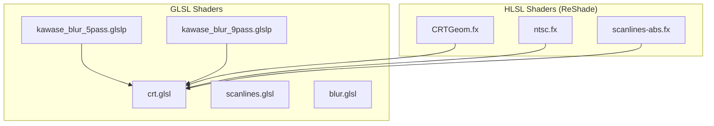
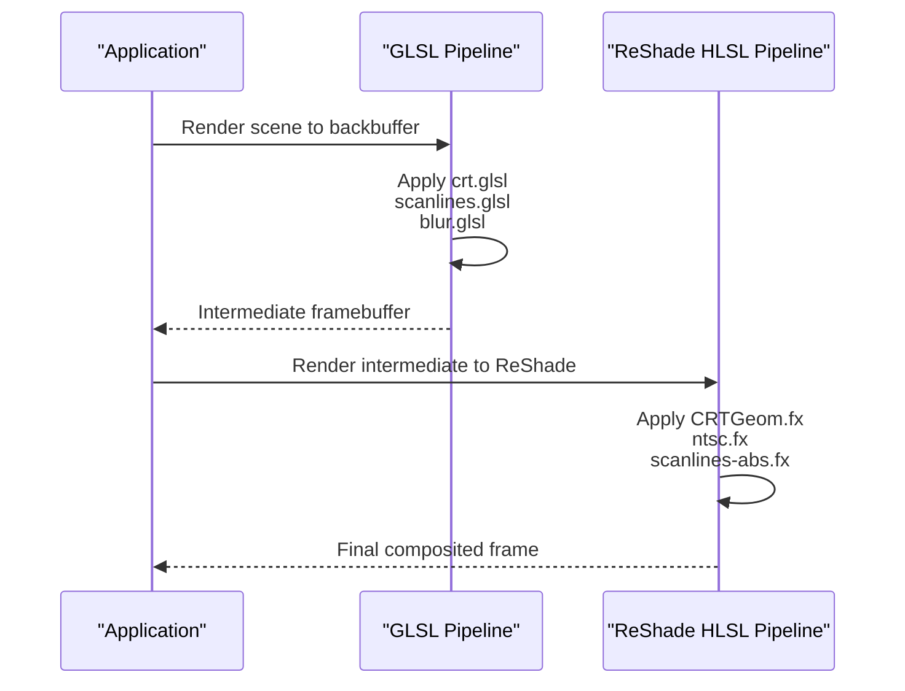
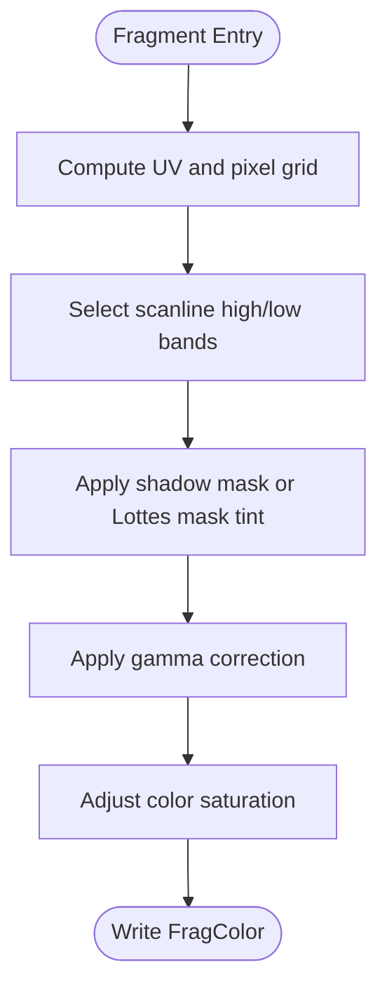
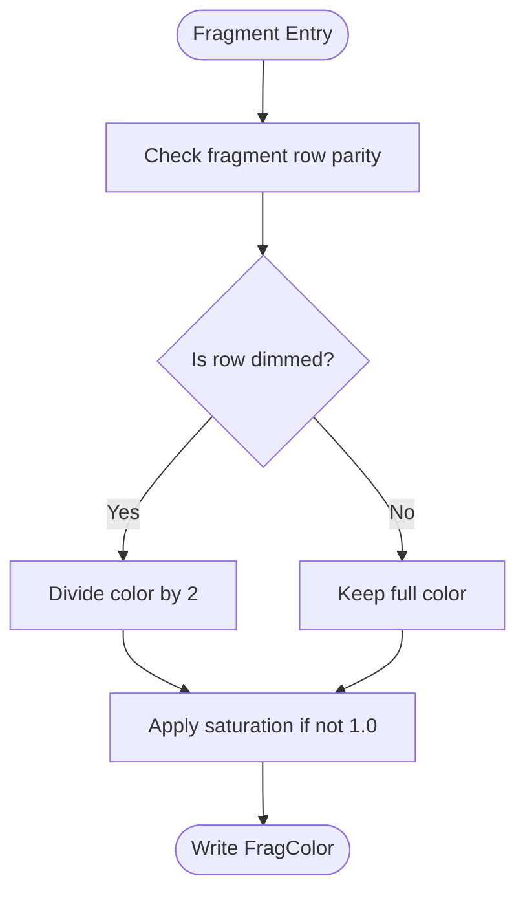
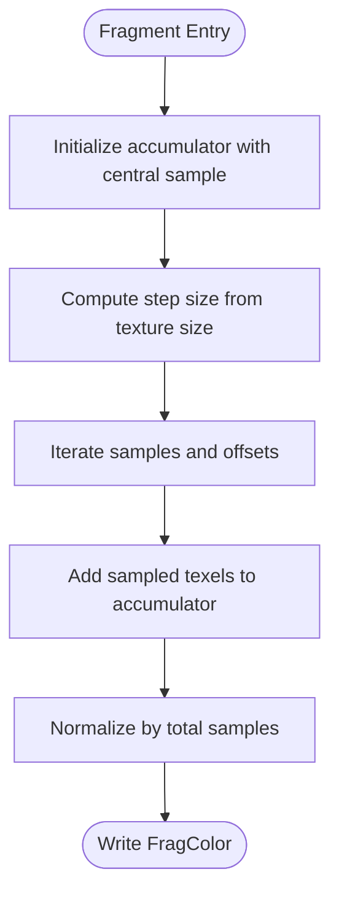
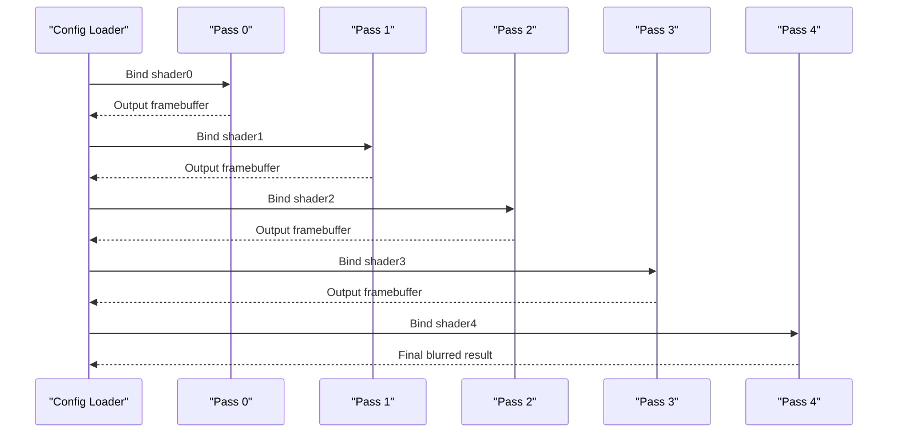
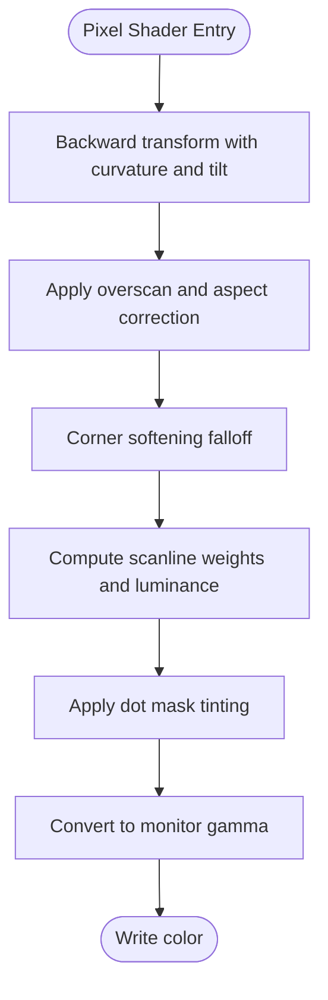
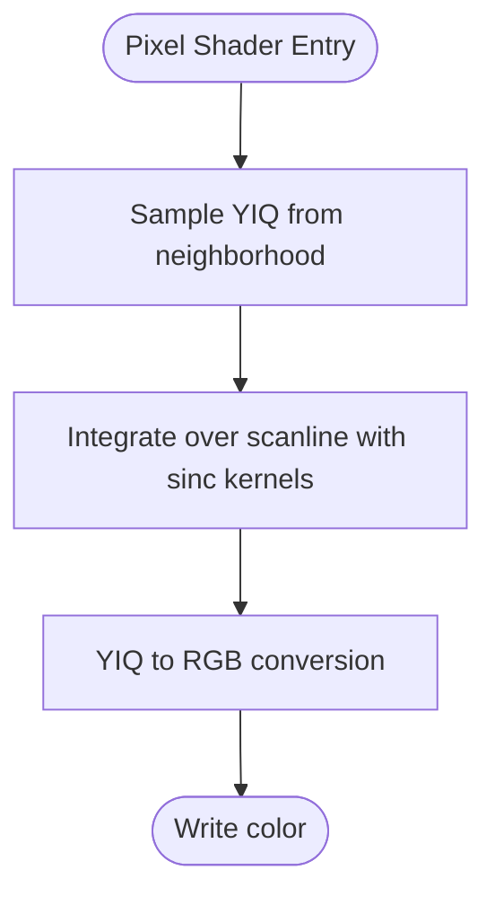
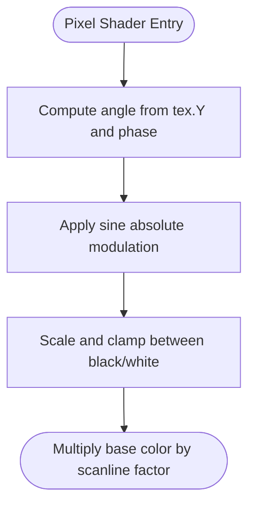
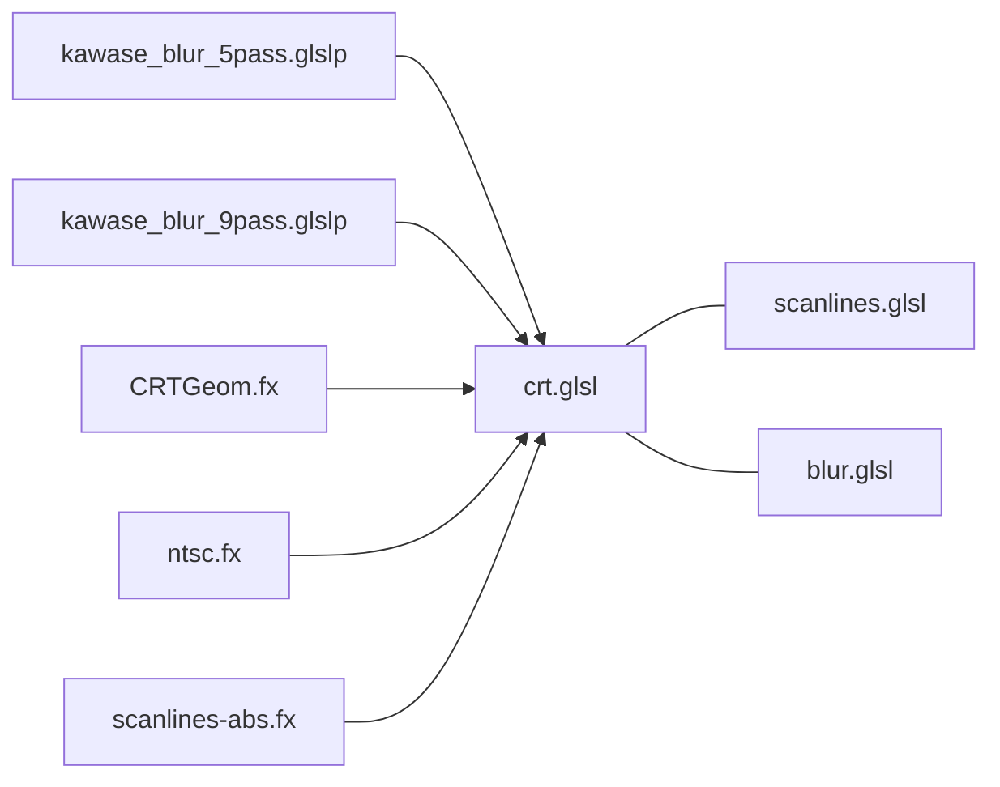

# Shader Configuration

<cite>
**Referenced Files in This Document**
- [crt.glsl](file://emulationstation/resources/shaders/crt.glsl)
- [scanlines.glsl](file://emulationstation/resources/shaders/scanlines.glsl)
- [blur.glsl](file://emulationstation/resources/shaders/blur.glsl)
- [kawase_blur_5pass.glslp](file://emulationstation/resources/shaders/kawase_blur_5pass.glslp)
- [kawase_blur_9pass.glslp](file://emulationstation/resources/shaders/kawase_blur_9pass.glslp)
- [CRTGeom.fx](file://system/shaders/configs/curvature/CRTGeom.fx)
- [ntsc.fx](file://system/shaders/configs/ntsc/ntsc.fx)
- [scanlines-abs.fx](file://system/shaders/configs/scanlines/scanlines-abs.fx)
</cite>

## Table of Contents
1. [Introduction](#introduction)
2. [Project Structure](#project-structure)
3. [Core Components](#core-components)
4. [Architecture Overview](#architecture-overview)
5. [Detailed Component Analysis](#detailed-component-analysis)
6. [Dependency Analysis](#dependency-analysis)
7. [Performance Considerations](#performance-considerations)
8. [Troubleshooting Guide](#troubleshooting-guide)
9. [Conclusion](#conclusion)
10. [Appendices](#appendices)

## Introduction
This document explains the shader configuration system used by the project’s rendering pipeline. It covers the shader categories present in the repository (CRT effects, scanlines, blur, curvature correction, and NTSC emulation), the GLSL and HLSL shader implementations, and the configuration file formats that define multi-pass shader chains. It also provides step-by-step guidance for creating custom shaders, modifying parameters, and troubleshooting graphics issues, along with hardware compatibility and performance tuning advice.

## Project Structure
The shader system is organized into two primary areas:
- GLSL-based shaders and multi-pass configuration files located under emulationstation/resources/shaders
- HLSL-based ReShade shaders and configuration files located under system/shaders/configs

Key directories and files:
- emulationstation/resources/shaders: GLSL vertex/fragment shaders and multi-pass configuration files
- system/shaders/configs: ReShade FX shaders and related configuration files

**Diagram sources**
- [crt.glsl](file://emulationstation/resources/shaders/crt.glsl)
- [scanlines.glsl](file://emulationstation/resources/shaders/scanlines.glsl)
- [blur.glsl](file://emulationstation/resources/shaders/blur.glsl)
- [kawase_blur_5pass.glslp](file://emulationstation/resources/shaders/kawase_blur_5pass.glslp)
- [kawase_blur_9pass.glslp](file://emulationstation/resources/shaders/kawase_blur_9pass.glslp)
- [CRTGeom.fx](file://system/shaders/configs/curvature/CRTGeom.fx)
- [ntsc.fx](file://system/shaders/configs/ntsc/ntsc.fx)
- [scanlines-abs.fx](file://system/shaders/configs/scanlines/scanlines-abs.fx)

**Section sources**
- [crt.glsl](file://emulationstation/resources/shaders/crt.glsl)
- [scanlines.glsl](file://emulationstation/resources/shaders/scanlines.glsl)
- [blur.glsl](file://emulationstation/resources/shaders/blur.glsl)
- [kawase_blur_5pass.glslp](file://emulationstation/resources/shaders/kawase_blur_5pass.glslp)
- [kawase_blur_9pass.glslp](file://emulationstation/resources/shaders/kawase_blur_9pass.glslp)
- [CRTGeom.fx](file://system/shaders/configs/curvature/CRTGeom.fx)
- [ntsc.fx](file://system/shaders/configs/ntsc/ntsc.fx)
- [scanlines-abs.fx](file://system/shaders/configs/scanlines/scanlines-abs.fx)

## Core Components
- CRT effect shader (GLSL): Implements scanline thickness, intensity, brightness boost, mask type and size, blur strength, gamma, and saturation.
- Scanlines shader (GLSL): Applies a simple scanline pattern and optional saturation adjustment.
- Blur shader (GLSL): Performs radial blur sampling around the current pixel using configurable blur size.
- Multi-pass blur configuration (GLSLP): Chains multiple passes of Kawase-style blur via configuration files.
- Curvature correction (HLSL/ReShade): CRT geometry shader with adjustable curvature radius, corner softening, overscan, gamma, and scanline weighting.
- NTSC emulation (HLSL/ReShade): Simulates analog TV signal processing and color decoding with tunable frequency responses and offsets.
- Scanlines absolute value (HLSL/ReShade): Lightweight scanline overlay using sine absolute value modulation.

**Section sources**
- [crt.glsl](file://emulationstation/resources/shaders/crt.glsl)
- [scanlines.glsl](file://emulationstation/resources/shaders/scanlines.glsl)
- [blur.glsl](file://emulationstation/resources/shaders/blur.glsl)
- [kawase_blur_5pass.glslp](file://emulationstation/resources/shaders/kawase_blur_5pass.glslp)
- [kawase_blur_9pass.glslp](file://emulationstation/resources/shaders/kawase_blur_9pass.glslp)
- [CRTGeom.fx](file://system/shaders/configs/curvature/CRTGeom.fx)
- [ntsc.fx](file://system/shaders/configs/ntsc/ntsc.fx)
- [scanlines-abs.fx](file://system/shaders/configs/scanlines/scanlines-abs.fx)

## Architecture Overview
The rendering pipeline integrates GLSL and HLSL shaders through a multi-stage process:
- GLSL shaders handle per-pixel computations for CRT simulation, scanlines, and blur.
- Multi-pass GLSLP configurations chain multiple GLSL shaders to achieve effects like separable Gaussian-like blur.
- HLSL ReShade shaders provide advanced CRT geometry, curvature, and NTSC signal emulation.

**Diagram sources**
- [crt.glsl](file://emulationstation/resources/shaders/crt.glsl)
- [scanlines.glsl](file://emulationstation/resources/shaders/scanlines.glsl)
- [blur.glsl](file://emulationstation/resources/shaders/blur.glsl)
- [CRTGeom.fx](file://system/shaders/configs/curvature/CRTGeom.fx)
- [ntsc.fx](file://system/shaders/configs/ntsc/ntsc.fx)
- [scanlines-abs.fx](file://system/shaders/configs/scanlines/scanlines-abs.fx)

## Detailed Component Analysis

### CRT Effect Shader (GLSL)
Purpose:
- Simulates CRT phosphor glow, scanlines, shadow mask or Lottes mask, blur, gamma correction, and saturation.

Key parameters:
- Scanline thickness and intensity
- Brightness boost
- Shadow mask type and size
- Blur strength
- Gamma and saturation

Processing logic:
- Vertex stage sets up varyings and inverse texture dimensions.
- Fragment stage computes scanline selection, applies mask tinting, gamma, and saturation.

**Diagram sources**
- [crt.glsl](file://emulationstation/resources/shaders/crt.glsl)

**Section sources**
- [crt.glsl](file://emulationstation/resources/shaders/crt.glsl)

### Scanlines Shader (GLSL)
Purpose:
- Adds a simple scanline overlay pattern and optional color saturation.

Processing logic:
- Alternates row-based intensity for scanlines.
- Optionally blends to grayscale based on saturation uniform.

**Diagram sources**
- [scanlines.glsl](file://emulationstation/resources/shaders/scanlines.glsl)

**Section sources**
- [scanlines.glsl](file://emulationstation/resources/shaders/scanlines.glsl)

### Blur Shader (GLSL)
Purpose:
- Performs radial blur sampling around the current pixel with a configurable number of samples.

Processing logic:
- Computes sample count from blur uniform.
- Accumulates neighboring texel colors using cosine/sine offsets scaled by step size.
- Normalizes the accumulated color and multiplies by vertex color.

**Diagram sources**
- [blur.glsl](file://emulationstation/resources/shaders/blur.glsl)

**Section sources**
- [blur.glsl](file://emulationstation/resources/shaders/blur.glsl)

### Multi-Pass Blur Configuration (GLSLP)
Purpose:
- Defines cascaded passes of a blur shader to approximate separable filtering.

Examples:
- 5-pass chain: starts with a base pass and increases kernel sizes in subsequent passes.
- 9-pass chain: extends the series with additional passes for stronger blur.

**Diagram sources**
- [kawase_blur_5pass.glslp](file://emulationstation/resources/shaders/kawase_blur_5pass.glslp)
- [kawase_blur_9pass.glslp](file://emulationstation/resources/shaders/kawase_blur_9pass.glslp)

**Section sources**
- [kawase_blur_5pass.glslp](file://emulationstation/resources/shaders/kawase_blur_5pass.glslp)
- [kawase_blur_9pass.glslp](file://emulationstation/resources/shaders/kawase_blur_9pass.glslp)

### Curvature Correction (HLSL/ReShade)
Purpose:
- Applies CRT geometry distortion with adjustable curvature radius, corner softening, overscan, gamma, and scanline weighting.

Key uniforms:
- Screen and frame sizes, target and monitor gamma, distance, curvature toggle, radius, corner size/smoothness, tilt, overscan percentages, dot mask, sharpness, scanline weight, luminance boost, interlacing toggle, oversampling, and interlaced mode.

Processing logic:
- Computes backward transformation from screen to texture coordinates considering curvature and tilt.
- Applies scanline weights and dot mask tinting.
- Converts gamma to monitor gamma and returns final color.

**Diagram sources**
- [CRTGeom.fx](file://system/shaders/configs/curvature/CRTGeom.fx)

**Section sources**
- [CRTGeom.fx](file://system/shaders/configs/curvature/CRTGeom.fx)

### NTSC Emulation (HLSL/ReShade)
Purpose:
- Simulates composite video signal processing and color decoding with sinc filtering and YIQ-to-RGB conversion.

Key uniforms:
- Tunable A, B, C (color carrier), offsets, scan time, notch bandwidth, and frequency responses for Y/I/Q channels.

Processing logic:
- Samples surrounding texels to compute composite YIQ.
- Integrates over scanline positions using sinc kernels and trigonometric filters.
- Converts filtered YIQ to RGB and writes the result.

**Diagram sources**
- [ntsc.fx](file://system/shaders/configs/ntsc/ntsc.fx)

**Section sources**
- [ntsc.fx](file://system/shaders/configs/ntsc/ntsc.fx)

### Scanlines Absolute Value (HLSL/ReShade)
Purpose:
- Lightweight scanline overlay using sine absolute value modulation with amplitude, phase, and black/white line controls.

Processing logic:
- Computes angle from texture Y coordinate and applies sine absolute modulation.
- Scales and clamps the result between configured black and white line intensities.

**Diagram sources**
- [scanlines-abs.fx](file://system/shaders/configs/scanlines/scanlines-abs.fx)

**Section sources**
- [scanlines-abs.fx](file://system/shaders/configs/scanlines/scanlines-abs.fx)

## Dependency Analysis
- CRT effect (GLSL) depends on standard uniforms (texture size, output size, input size) and defines its own parameter uniforms.
- Scanlines (GLSL) depends on a single saturation uniform and uses row parity checks.
- Blur (GLSL) depends on blur size uniform and performs radial sampling.
- Multi-pass blur (GLSLP) composes multiple GLSL shaders in order.
- CRTGeom (HLSL) depends on ReShade backbuffer and exposes numerous runtime parameters.
- NTSC (HLSL) depends on ReShade backbuffer and frequency response parameters.
- Scanlines absolute value (HLSL) depends on texture size and modulation parameters.

**Diagram sources**
- [crt.glsl](file://emulationstation/resources/shaders/crt.glsl)
- [scanlines.glsl](file://emulationstation/resources/shaders/scanlines.glsl)
- [blur.glsl](file://emulationstation/resources/shaders/blur.glsl)
- [kawase_blur_5pass.glslp](file://emulationstation/resources/shaders/kawase_blur_5pass.glslp)
- [kawase_blur_9pass.glslp](file://emulationstation/resources/shaders/kawase_blur_9pass.glslp)
- [CRTGeom.fx](file://system/shaders/configs/curvature/CRTGeom.fx)
- [ntsc.fx](file://system/shaders/configs/ntsc/ntsc.fx)
- [scanlines-abs.fx](file://system/shaders/configs/scanlines/scanlines-abs.fx)

**Section sources**
- [crt.glsl](file://emulationstation/resources/shaders/crt.glsl)
- [scanlines.glsl](file://emulationstation/resources/shaders/scanlines.glsl)
- [blur.glsl](file://emulationstation/resources/shaders/blur.glsl)
- [kawase_blur_5pass.glslp](file://emulationstation/resources/shaders/kawase_blur_5pass.glslp)
- [kawase_blur_9pass.glslp](file://emulationstation/resources/shaders/kawase_blur_9pass.glslp)
- [CRTGeom.fx](file://system/shaders/configs/curvature/CRTGeom.fx)
- [ntsc.fx](file://system/shaders/configs/ntsc/ntsc.fx)
- [scanlines-abs.fx](file://system/shaders/configs/scanlines/scanlines-abs.fx)

## Performance Considerations
- Prefer separable multi-pass blur chains (Kawase) for cost-effective large-radius blur.
- Reduce blur sample counts or texture step sizes to improve performance on low-end GPUs.
- Disable oversampling and interlacing toggles in CRTGeom when unnecessary.
- Lower curvature radius and corner smoothness to reduce trigonometric computations.
- Use scanline overlays sparingly; simpler scanlines shaders are cheaper than complex CRT geometry.
- Choose appropriate scanline weights and luminance boosts to balance quality and throughput.
- On mobile or integrated GPUs, favor fewer passes and lower resolutions for real-time performance.

[No sources needed since this section provides general guidance]

## Troubleshooting Guide
Common issues and remedies:
- Incorrect scanline alignment or spacing:
  - Adjust scanline thickness and intensity parameters in the CRT GLSL shader.
  - Verify texture size and output size uniforms are set consistently.
- Excessive blur or motion artifacts:
  - Reduce blur size uniform or number of multi-pass blur stages.
  - Ensure proper step size calculation from texture size.
- Overly dark or washed-out colors:
  - Tune gamma and saturation parameters in the CRT shader.
  - For CRTGeom, adjust monitor gamma to match your display.
- CRT curvature looks distorted:
  - Lower curvature radius or increase corner smoothness.
  - Verify overscan percentages and aspect ratio constants.
- NTSC emulation produces noise or banding:
  - Increase sample count and adjust frequency responses.
  - Verify scan time and color carrier parameters align with source frame rate.
- Scanlines appear too strong or weak:
  - Modify amplitude and black/white line parameters in the scanlines absolute value shader.

**Section sources**
- [crt.glsl](file://emulationstation/resources/shaders/crt.glsl)
- [scanlines.glsl](file://emulationstation/resources/shaders/scanlines.glsl)
- [blur.glsl](file://emulationstation/resources/shaders/blur.glsl)
- [CRTGeom.fx](file://system/shaders/configs/curvature/CRTGeom.fx)
- [ntsc.fx](file://system/shaders/configs/ntsc/ntsc.fx)
- [scanlines-abs.fx](file://system/shaders/configs/scanlines/scanlines-abs.fx)

## Conclusion
The shader configuration system combines GLSL and HLSL shaders to deliver CRT aesthetics, scanlines, blur, curvature correction, and NTSC emulation. By understanding the parameter spaces and pass ordering, users can tailor visual fidelity and performance to their hardware. Multi-pass configurations enable scalable blur effects, while ReShade FX shaders provide advanced CRT geometry and signal processing.

[No sources needed since this section summarizes without analyzing specific files]

## Appendices

### Step-by-Step: Creating a Custom GLSL CRT Shader
- Define parameter uniforms for scanline thickness, intensity, brightness boost, mask type/size, blur, gamma, and saturation.
- Implement vertex stage to pass UVs and inverse texture dimensions.
- Implement fragment stage to:
  - Compute scanline selection based on thickness and position.
  - Apply mask tinting (CGWG/Lottes variants).
  - Apply gamma correction and saturation.
- Test with a minimal scene and tune parameters incrementally.

**Section sources**
- [crt.glsl](file://emulationstation/resources/shaders/crt.glsl)

### Step-by-Step: Adding a New Multi-Pass Blur Chain
- Create a new .glslp configuration file specifying the number of shaders and their order.
- Ensure each chained shader exists in the kawase directory and is compatible with the previous pass output.
- Load the configuration and verify the final blurred result.

**Section sources**
- [kawase_blur_5pass.glslp](file://emulationstation/resources/shaders/kawase_blur_5pass.glslp)
- [kawase_blur_9pass.glslp](file://emulationstation/resources/shaders/kawase_blur_9pass.glslp)

### Step-by-Step: Modifying CRTGeom Parameters
- Open the CRTGeom.fx file and adjust uniforms such as curvature radius, corner size/smoothness, overscan, gamma, and scanline weight.
- Recompile or reload the shader in ReShade and iterate until the desired CRT appearance is achieved.

**Section sources**
- [CRTGeom.fx](file://system/shaders/configs/curvature/CRTGeom.fx)

### Step-by-Step: Tuning NTSC Emulation
- Adjust A, B, C (color carrier), notch bandwidth, and frequency responses.
- Set scan time to match the source frame rate.
- Increase sample count for smoother results; reduce for performance.

**Section sources**
- [ntsc.fx](file://system/shaders/configs/ntsc/ntsc.fx)

### Step-by-Step: Creating a Custom Scanlines Overlay
- Implement a lightweight scanlines shader similar to scanlines-abs.fx.
- Expose amplitude, phase, and black/white line controls.
- Compose with the CRT pipeline to fine-tune perceived intensity.

**Section sources**
- [scanlines-abs.fx](file://system/shaders/configs/scanlines/scanlines-abs.fx)

### Hardware Compatibility and Driver Requirements
- GLSL shaders require OpenGL ES or desktop OpenGL with support for GLSL 1.20+ and varyings/out qualifiers.
- HLSL ReShade shaders require a compatible ReShade installation and DirectX 9/11 backend.
- Prefer modern GPUs for accurate trigonometric and texture sampling performance.
- Integrated GPUs may require reduced blur passes and lower curvature settings.

[No sources needed since this section provides general guidance]