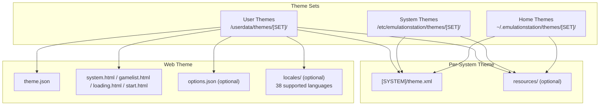
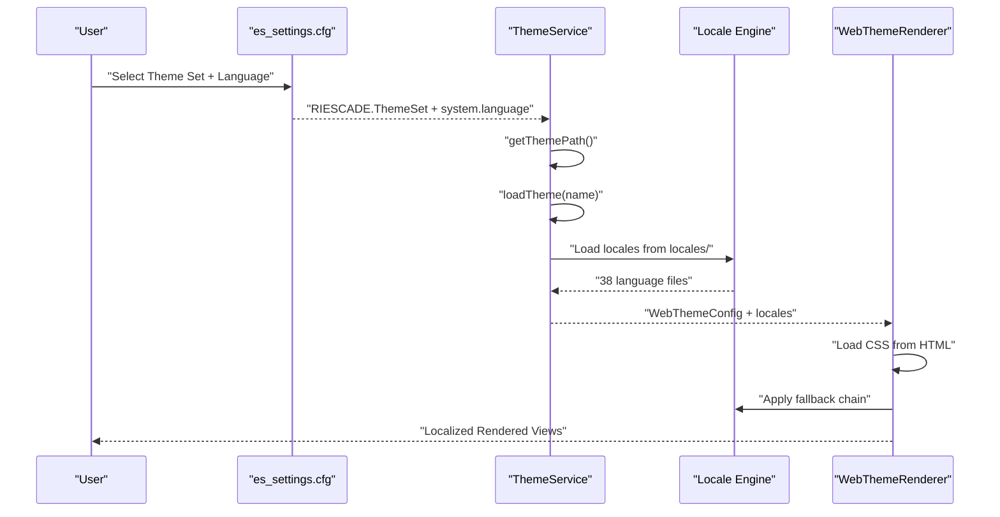
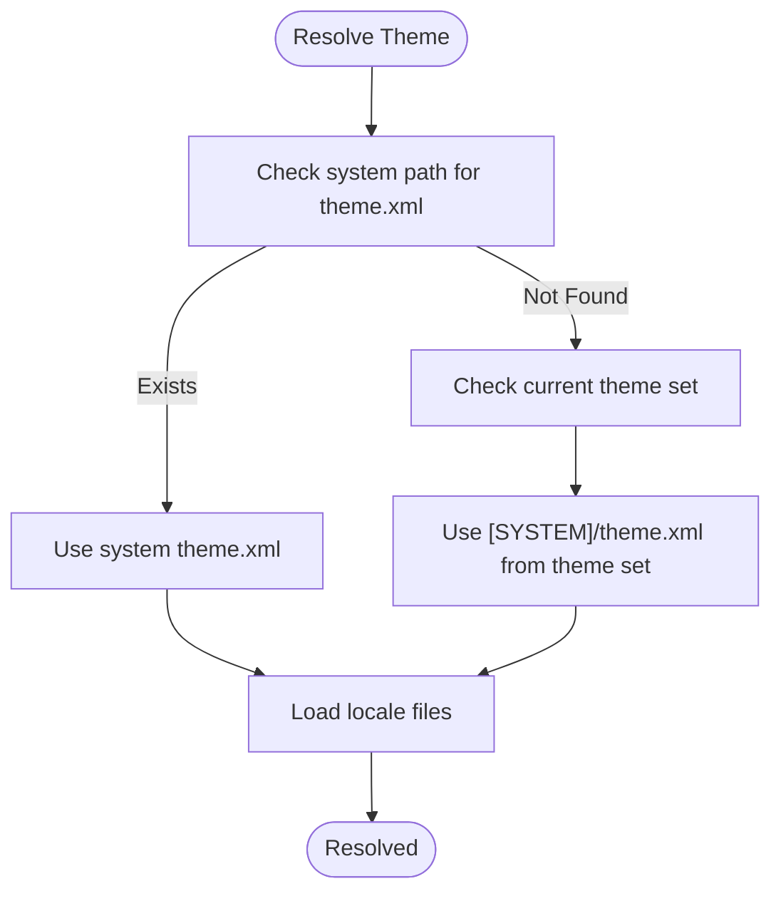
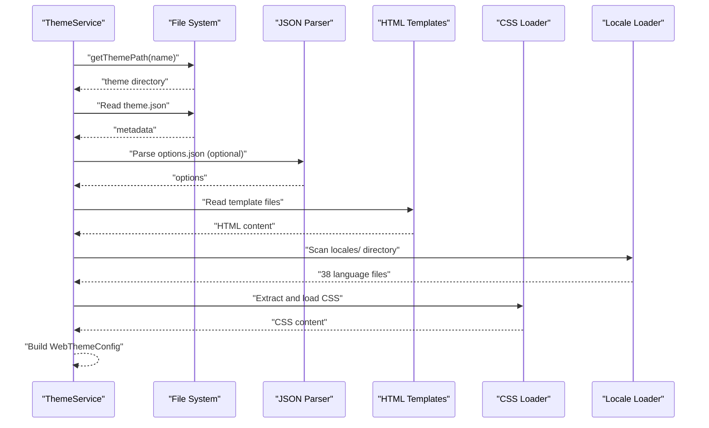
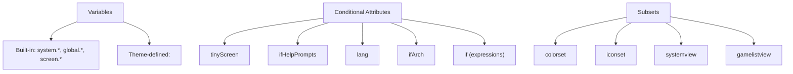
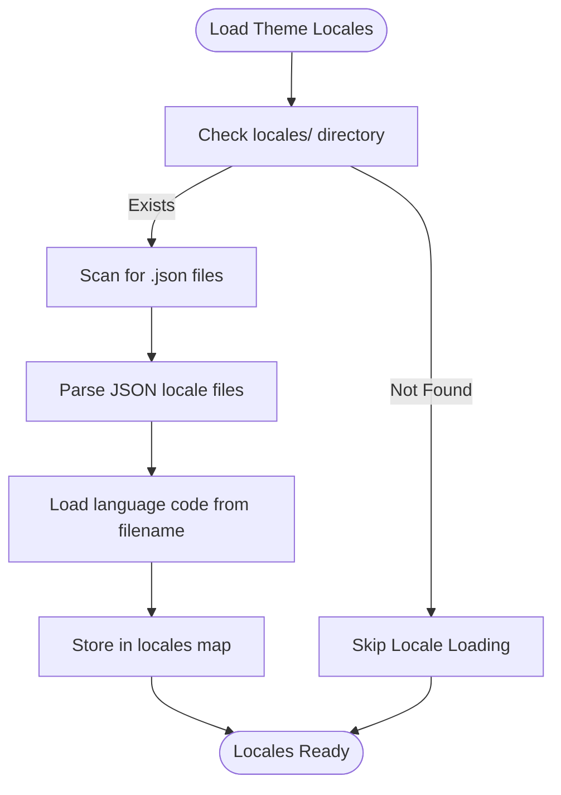
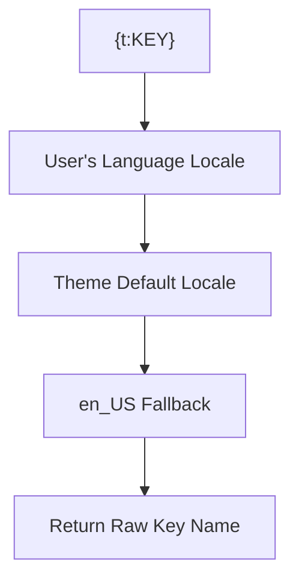
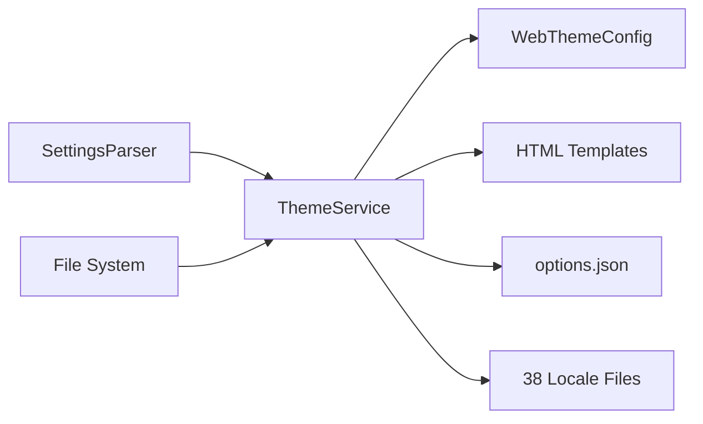

# Theme Management

<cite>
**Referenced Files in This Document**
- [THEMES.md](file://emulationstation/.riescade/src/docs/THEMES.md)
- [ThemeService.ts](file://emulationstation/.riescade/src/src/main/services/ThemeService.ts)
- [WebThemeRenderer.tsx](file://emulationstation/.riescade/src/src/renderer/src/components/theme/WebThemeRenderer.tsx)
- [ApiSystem.cpp](file://emulationstation/.riescade/src/src/main/services/ApiSystem.ts)
- [THEMES.md](file://emulationstation/.riescade/src/docs/THEMES.md)
- [es_systems.cfg](file://emulationstation/.emulationstation/es_systems.cfg)
- [es_settings.cfg](file://emulationstation/.emulationstation/es_settings.cfg)
- [LangParser.cpp](file://emulationstation/.riescade/src/docs/es_src/LangParser.cpp)
- [GuiMenu.cpp](file://emulationstation/.riescade/src/docs/es_src/guis/GuiMenu.cpp)
- [emulationstation2.po](file://emulationstation/resources/locale/ar/LC_MESSAGES/emulationstation2.po)
- [zh_CN emulationstation2.po](file://emulationstation/resources/locale/zh_CN/LC_MESSAGES/emulationstation2.po)
- [translate.py](file://emulationstation/.riescade/src/scratch/translate.py)
</cite>

## Update Summary
**Changes Made**
- Added comprehensive internationalization (i18n) system documentation with 38 supported locales
- Updated ThemeService.ts section to reflect locale loading functionality
- Added fallback chain system documentation for theme translations
- Enhanced language support matrix with complete locale coverage
- Updated troubleshooting section with i18n-specific guidance

## Table of Contents
1. [Introduction](#introduction)
2. [Project Structure](#project-structure)
3. [Core Components](#core-components)
4. [Architecture Overview](#architecture-overview)
5. [Detailed Component Analysis](#detailed-component-analysis)
6. [Internationalization System](#internationalization-system)
7. [Dependency Analysis](#dependency-analysis)
8. [Performance Considerations](#performance-considerations)
9. [Troubleshooting Guide](#troubleshooting-guide)
10. [Conclusion](#conclusion)
11. [Appendices](#appendices)

## Introduction
This document explains how EmulationStation manages themes across the interface, including the comprehensive internationalization (i18n) system. It covers theme discovery, loading, and application, including XML structure, resource organization, locale handling, and the relationship between theme definitions and system configurations. Practical guidance is provided for installing, customizing, and troubleshooting themes, along with performance considerations for smooth rendering.

## Project Structure
Themes are organized as theme sets under user-accessible directories. Each theme set contains per-system theme.xml files and optional shared resources. Themes can also be packaged as web themes with HTML/CSS templates, optional metadata, and comprehensive locale support.



**Diagram sources**
- [THEMES.md:37-53](file://emulationstation/.riescade/src/docs/THEMES.md#L37-L53)
- [ThemeService.ts:34-65](file://emulationstation/.riescade/src/src/main/services/ThemeService.ts#L34-L65)

**Section sources**
- [THEMES.md:37-53](file://emulationstation/.riescade/src/docs/THEMES.md#L37-L53)
- [ThemeService.ts:34-65](file://emulationstation/.riescade/src/src/main/services/ThemeService.ts#L34-L65)

## Core Components
- Theme discovery and selection:
  - Active theme set is stored in settings and controls which theme set is loaded.
  - Per-system themes are resolved via system configuration and theme.xml files.
- Theme loading pipeline:
  - Web themes are loaded from theme.json and HTML templates.
  - Legacy XML themes are parsed and applied to views.
  - Locale files are automatically loaded from the locales/ directory.
- Resource resolution:
  - Theme resources override built-in resources when placed under a resources folder.
  - CSS in web themes is dynamically loaded and injected.
  - Translations are resolved through a comprehensive fallback chain system.

**Section sources**
- [es_settings.cfg:154-154](file://emulationstation/.emulationstation/es_settings.cfg#L154-L154)
- [es_systems.cfg:1-20](file://emulationstation/.emulationstation/es_systems.cfg#L1-L20)
- [THEMES.md:6-53](file://emulationstation/.riescade/src/docs/THEMES.md#L6-L53)
- [ThemeService.ts:52-65](file://emulationstation/.riescade/src/src/main/services/ThemeService.ts#L52-L65)
- [WebThemeRenderer.tsx:35-106](file://emulationstation/.riescade/src/src/renderer/src/components/theme/WebThemeRenderer.tsx#L35-L106)

## Architecture Overview
The theme system integrates three layers with comprehensive internationalization support:
- Settings-driven selection: The active theme set is read from configuration.
- Theme resolution: System-specific theme.xml or web theme templates are located.
- Rendering: Web themes render via HTML/CSS with automatic locale resolution.
- Internationalization: Translation engine handles 38 supported languages with fallback chains.



**Diagram sources**
- [es_settings.cfg:154-154](file://emulationstation/.emulationstation/es_settings.cfg#L154-L154)
- [ThemeService.ts:52-135](file://emulationstation/.riescade/src/src/main/services/ThemeService.ts#L52-L135)
- [WebThemeRenderer.tsx:35-106](file://emulationstation/.riescade/src/src/renderer/src/components/theme/WebThemeRenderer.tsx#L35-L106)

## Detailed Component Analysis

### Theme Discovery and Selection
- Active theme set:
  - The setting RIESCADE.ThemeSet defines the current theme set name.
- System theme resolution:
  - If a system's theme.xml exists in the system path, it is used.
  - Otherwise, the current theme set is consulted for [SYSTEM]/theme.xml.
  - If both exist, the home/system path takes precedence.



**Diagram sources**
- [THEMES.md:6-53](file://emulationstation/.riescade/src/docs/THEMES.md#L6-L53)
- [es_systems.cfg:1-20](file://emulationstation/.emulationstation/es_systems.cfg#L1-L20)

**Section sources**
- [THEMES.md:6-53](file://emulationstation/.riescade/src/docs/THEMES.md#L6-L53)
- [es_systems.cfg:1-20](file://emulationstation/.emulationstation/es_systems.cfg#L1-L20)

### Theme Loading Pipeline (Web Themes)
- ThemeService locates the theme directory and reads theme.json for metadata.
- Templates are loaded from system.html, gamelist.html, loading.html, and start.html.
- Options.json is optionally loaded for theme-specific options.
- Locales directory is scanned for 38 supported language files.
- CSS is extracted from HTML and dynamically loaded for injection.



**Diagram sources**
- [ThemeService.ts:52-135](file://emulationstation/.riescade/src/src/main/services/ThemeService.ts#L52-L135)
- [WebThemeRenderer.tsx:35-106](file://emulationstation/.riescade/src/src/renderer/src/components/theme/WebThemeRenderer.tsx#L35-L106)

**Section sources**
- [ThemeService.ts:52-135](file://emulationstation/.riescade/src/src/main/services/ThemeService.ts#L52-L135)
- [WebThemeRenderer.tsx:35-106](file://emulationstation/.riescade/src/src/renderer/src/components/theme/WebThemeRenderer.tsx#L35-L106)

### Theme Variables, Conditional Styling, and Subsets
- Static variables:
  - Built-in variables include system, global, and screen properties.
  - Theme-defined variables can be declared and reused.
- Conditional styling:
  - Attributes tinyScreen, ifHelpPrompts, lang, ifSubset, ifArch, and if enable runtime filtering.
- Subsets:
  - Define mutually exclusive groups (e.g., colorset, iconset, systemview) with a single active member per subset.



**Diagram sources**
- [THEMES.md:368-505](file://emulationstation/.riescade/src/docs/THEMES.md#L368-L505)
- [THEMES.md:193-216](file://emulationstation/.riescade/src/docs/THEMES.md#L193-L216)

**Section sources**
- [THEMES.md:368-505](file://emulationstation/.riescade/src/docs/THEMES.md#L368-L505)
- [THEMES.md:193-216](file://emulationstation/.riescade/src/docs/THEMES.md#L193-L216)

### Resource Overrides and Responsive Design
- Resource overrides:
  - Place a resources folder in the theme root to override built-in assets.
- Responsive design:
  - Use normalized positions and sizes, and conditional attributes to adapt to screen geometry and languages.

**Section sources**
- [THEMES.md:1475-1494](file://emulationstation/.riescade/src/docs/THEMES.md#L1475-L1494)

### Installation and Compatibility
- Installation locations:
  - User themes: /userdata/themes/[SET]/
  - System themes: /etc/emulationstation/themes/[SET]/
  - Home themes: ~/.emulationstation/themes/[SET]/
- Compatibility:
  - Theme sets are identified by name; ensure the theme.json metadata matches the intended structure.
  - Locale files are automatically detected from the locales/ directory.

**Section sources**
- [THEMES.md:37-53](file://emulationstation/.riescade/src/docs/THEMES.md#L37-L53)
- [ThemeService.ts:34-65](file://emulationstation/.riescade/src/src/main/services/ThemeService.ts#L34-L65)

### Practical Examples
- Changing the active theme set:
  - Modify the RIESCADE.ThemeSet setting to a valid theme set name.
- Creating a simple theme:
  - Add a theme.xml with a formatVersion and target a view/element to change.
- Theming multiple elements simultaneously:
  - Use a single rule with multiple element names separated by commas for the same type.
- Using subsets:
  - Define multiple includes with the same subset name and activate one via settings.
- Adding locale support:
  - Create JSON files in the locales/ directory for each supported language.

**Section sources**
- [es_settings.cfg:154-154](file://emulationstation/.emulationstation/es_settings.cfg#L154-L154)
- [THEMES.md:58-75](file://emulationstation/.riescade/src/docs/THEMES.md#L58-L75)
- [THEMES.md:261-310](file://emulationstation/.riescade/src/docs/THEMES.md#L261-L310)
- [THEMES.md:193-216](file://emulationstation/.riescade/src/docs/THEMES.md#L193-L216)

## Internationalization System

### Comprehensive Locale Support
The theme system now supports 38 languages with automatic fallback mechanisms:

**Supported Languages:**
- Arabic (ar), Catalan (ca), Czech (cs_CZ), Welsh (cy_GB)
- German (de), Greek (el), British English (en_GB), American English (en_US)
- Spanish variants (es, es_ES, es_MX), Basque (eu_ES), Finnish (fi_FI)
- French variants (fr, fr_FR), Galician (gl_ES), Hebrew (he)
- Hungarian (hu), Indonesian (id_ID), Italian (it), Japanese (ja_JP)
- Korean (ko), Norwegian variants (nb_NO, nn_NO), Occitan (oc_FR)
- Polish (pl), Brazilian Portuguese (pt_BR), European Portuguese (pt_PT)
- Romanian (ro_RO), Russian (ru_RU), Slovak (sk_SK), Swedish (sv_SE)
- Turkish (tr), Ukrainian (uk_UA), Vietnamese (vi_VN)
- Simplified Chinese (zh_CN), Traditional Chinese (zh_TW)

### Locale Loading Mechanism
ThemeService automatically loads locale files from the locales/ directory:



**Diagram sources**
- [ThemeService.ts:122-139](file://emulationstation/.riescade/src/src/main/services/ThemeService.ts#L122-L139)

### Fallback Chain System
When resolving translations, the engine follows this priority order:

1. **User's current language** (e.g., `fr_FR.json` if the user selected French)
2. **Theme's defaultLocale** (defined in `theme.json`)
3. **Universal fallback** (`en_US.json`)
4. **Raw key name** if no translation is found



**Diagram sources**
- [THEMES.md:125-133](file://emulationstation/.riescade/src/docs/THEMES.md#L125-L133)

### Locale File Structure
Each locale file follows JSON format with key-value pairs:

```json
{
  "EMPTY_GAMELIST": "Nao temos jogos neste sistema.",
  "LOADING_GAMELIST": "Carregando Lista de Jogos",
  "LOADING": "Carregando",
  "ALL_GAMES": "Todos os jogos",
  "FAVORITES": "Favoritos"
}
```

### Language Detection and Processing
The system includes sophisticated language detection and processing:

- **Language parsing**: Extracts language codes from system configuration
- **Region handling**: Supports both language-only (e.g., `en`) and locale-specific (e.g., `en_US`) formats
- **Fallback logic**: Automatically handles region-specific variants and generic language fallbacks

**Section sources**
- [THEMES.md:103-146](file://emulationstation/.riescade/src/docs/THEMES.md#L103-L146)
- [ThemeService.ts:122-139](file://emulationstation/.riescade/src/src/main/services/ThemeService.ts#L122-L139)
- [LangParser.cpp:77-93](file://emulationstation/.riescade/src/docs/es_src/LangParser.cpp#L77-L93)
- [GuiMenu.cpp:1320-1338](file://emulationstation/.riescade/src/docs/es_src/guis/GuiMenu.cpp#L1320-L1338)

## Dependency Analysis
ThemeService depends on:
- SettingsParser to read the active theme set.
- File system to enumerate user themes and locate theme.json and template files.
- ThemeSettingsParser to read per-theme settings.
- Locale loader to process 38 language files from the locales/ directory.



**Diagram sources**
- [ThemeService.ts:24-28](file://emulationstation/.riescade/src/src/main/services/ThemeService.ts#L24-L28)
- [ThemeService.ts:52-135](file://emulationstation/.riescade/src/src/main/services/ThemeService.ts#L52-L135)

**Section sources**
- [ThemeService.ts:24-28](file://emulationstation/.riescade/src/src/main/services/ThemeService.ts#L24-L28)
- [ThemeService.ts:52-135](file://emulationstation/.riescade/src/src/main/services/ThemeService.ts#L52-L135)

## Performance Considerations
- Prefer web themes with efficient CSS and minimal DOM for smoother rendering.
- Use normalized units and avoid excessive z-index stacking.
- Limit heavy animations and video elements; leverage lazy loading where possible.
- Keep resource files optimized (images, fonts) and reuse assets via the resources override mechanism.
- Locale files are loaded once during theme initialization; consider gzip compression for large translation files.
- The 38 language files are cached in memory for fast lookup during rendering.

## Troubleshooting Guide
- Theme not applying:
  - Verify RIESCADE.ThemeSet points to an existing theme set.
  - Confirm the system's theme.xml exists or the theme set contains [SYSTEM]/theme.xml.
- Web theme not loading:
  - Ensure theme.json exists and template files are present.
  - Check that CSS links resolve correctly and are accessible.
- Resource conflicts:
  - Place a resources folder in the theme root to override built-in assets.
- Theme installation issues:
  - Confirm installation paths and permissions for /userdata/themes and /etc/emulationstation/themes.
- **Internationalization issues**:
  - Verify locale files are properly formatted JSON in the locales/ directory.
  - Check that language codes match the supported 38 languages.
  - Ensure theme.json includes defaultLocale if using fallback chains.
  - Confirm system.language setting matches available locale files.

**Section sources**
- [es_settings.cfg:154-154](file://emulationstation/.emulationstation/es_settings.cfg#L154-L154)
- [THEMES.md:6-53](file://emulationstation/.riescade/src/docs/THEMES.md#L6-L53)
- [THEMES.md:1475-1494](file://emulationstation/.riescade/src/docs/THEMES.md#L1475-L1494)
- [ThemeService.ts:72-135](file://emulationstation/.riescade/src/src/main/services/ThemeService.ts#L72-L135)
- [WebThemeRenderer.tsx:35-106](file://emulationstation/.riescade/src/src/renderer/src/components/theme/WebThemeRenderer.tsx#L35-L106)

## Conclusion
EmulationStation's theme system supports flexible, per-system theming through both XML and web-based templates with comprehensive internationalization. The addition of 38 supported languages with automatic fallback chains ensures themes can be localized effectively. By understanding theme discovery, loading, rendering, and the internationalization system, users can effectively install, customize, and troubleshoot themes. Leveraging variables, conditional attributes, subsets, and the locale system enables powerful and maintainable designs that adapt to diverse hardware, preferences, and linguistic requirements.

## Appendices

### Theme XML Reference Highlights
- Views: system, basic, detailed, grid, video, menu, screen.
- Common elements: image, video, text, textlist, imagegrid, rating, datetime, carousel, helpsystem, ninepatch, sound.
- Properties: normalized pairs, paths, booleans, colors, floats, strings; plus advanced features like z-index and storyboards.

**Section sources**
- [THEMES.md:516-1201](file://emulationstation/.riescade/src/docs/THEMES.md#L516-L1201)

### Complete Language Support Matrix
**38 Supported Languages:**
- `ar` (Arabic), `ca` (Catalan), `cs_CZ` (Czech), `cy_GB` (Welsh)
- `de` (German), `el` (Greek), `en_GB` (British English), `en_US` (American English)
- `es` (Spanish), `es_ES` (Spanish Spain), `es_MX` (Spanish Mexico)
- `eu_ES` (Basque), `fi_FI` (Finnish), `fr` (French), `fr_FR` (French France)
- `gl_ES` (Galician), `he` (Hebrew), `hu` (Hungarian), `id_ID` (Indonesian)
- `it` (Italian), `ja_JP` (Japanese), `ko` (Korean), `nb_NO` (Norwegian Bokmal)
- `nl` (Dutch), `nn_NO` (Norwegian), `oc_FR` (Occitan), `pl` (Polish)
- `pt_BR` (Portuguese Brazil), `pt_PT` (Portuguese Portugal), `ro_RO` (Romanian)
- `ru_RU` (Russian), `sk_SK` (Slovak), `sv_SE` (Swedish), `tr` (Turkish)
- `uk_UA` (Ukrainian), `vi_VN` (Vietnamese), `zh_CN` (Simplified Chinese), `zh_TW` (Traditional Chinese)

**Section sources**
- [THEMES.md:134-140](file://emulationstation/.riescade/src/docs/THEMES.md#L134-L140)
- [GuiMenu.cpp:1320-1338](file://emulationstation/.riescade/src/docs/es_src/guis/GuiMenu.cpp#L1320-L1338)

### Locale File Examples
**Arabic Translation Example:**
```json
{
  "LOADING": "يبحث",
  "SEARCHING": "يبحث",
  "EMPTY_GAMELIST": "لم يتم العثور على عاب - تخطي"
}
```

**Chinese Translation Example:**
```json
{
  "LOADING": "搜索中",
  "SEARCHING": "搜索中",
  "EMPTY_GAMELIST": "未发现游戏 - 跳过"
}
```

**Section sources**
- [emulationstation2.po:31-50](file://emulationstation/resources/locale/ar/LC_MESSAGES/emulationstation2.po#L31-L50)
- [zh_CN emulationstation2.po:16-20](file://emulationstation/resources/locale/zh_CN/LC_MESSAGES/emulationstation2.po#L16-L20)