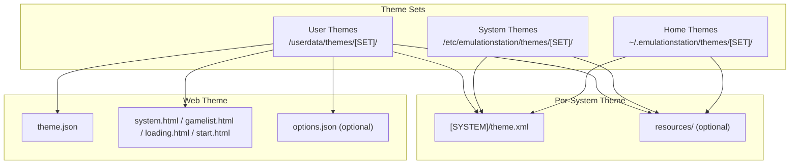
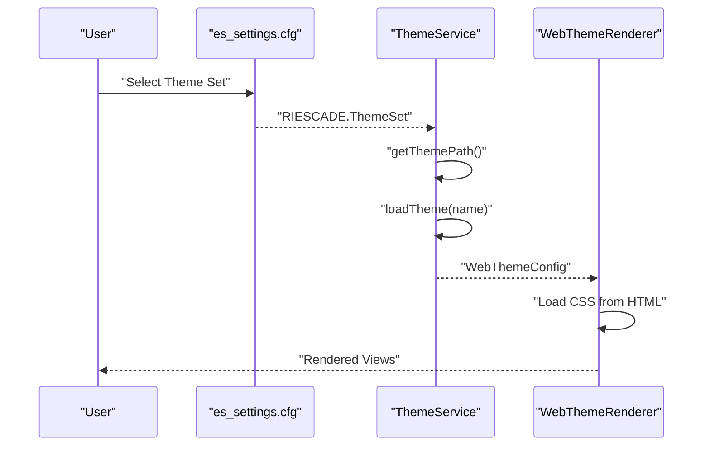
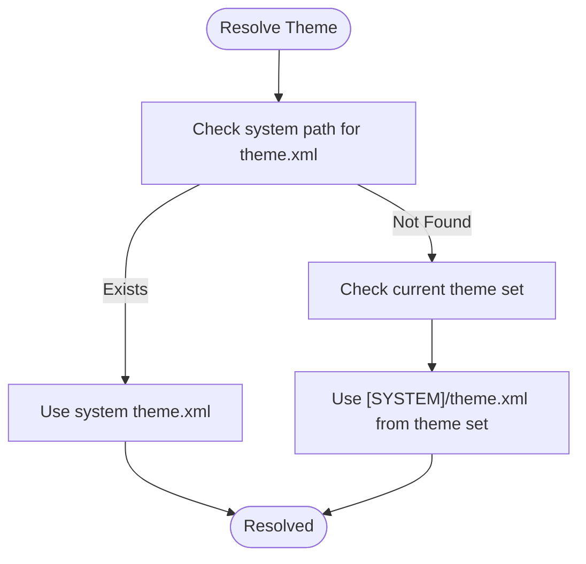
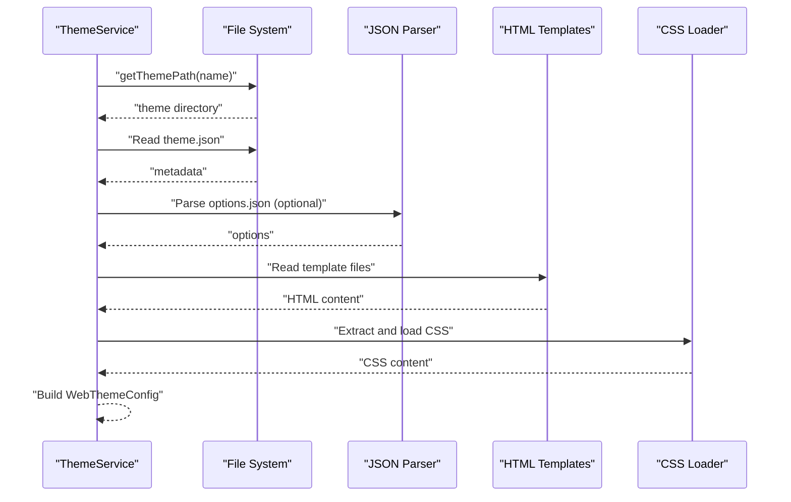
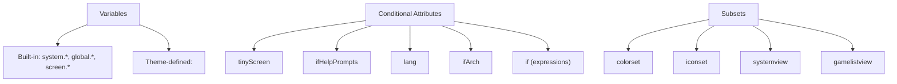
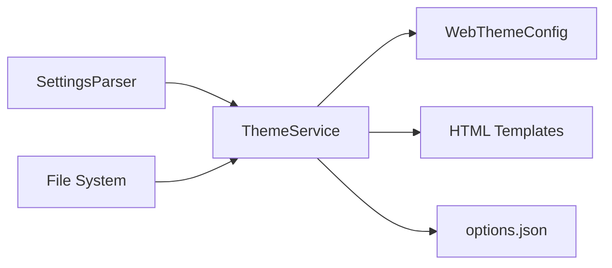

# Theme Management

<cite>
**Referenced Files in This Document**
- [THEMES.md](file://emulationstation/.riescade/src/docs/THEMES.md)
- [ThemeData.cpp](file://emulationstation/.riescade/src/src/main/services/ThemeService.ts)
- [WebThemeRenderer.tsx](file://emulationstation/.riescade/src/src/renderer/src/components/theme/WebThemeRenderer.tsx)
- [ApiSystem.cpp](file://emulationstation/.riescade/src/src/main/services/ApiSystem.ts)
- [THEMES.md](file://emulationstation/.riescade/src/docs/THEMES.md)
- [es_systems.cfg](file://emulationstation/.emulationstation/es_systems.cfg)
- [es_settings.cfg](file://emulationstation/.emulationstation/es_settings.cfg)
</cite>

## Table of Contents
1. [Introduction](#introduction)
2. [Project Structure](#project-structure)
3. [Core Components](#core-components)
4. [Architecture Overview](#architecture-overview)
5. [Detailed Component Analysis](#detailed-component-analysis)
6. [Dependency Analysis](#dependency-analysis)
7. [Performance Considerations](#performance-considerations)
8. [Troubleshooting Guide](#troubleshooting-guide)
9. [Conclusion](#conclusion)
10. [Appendices](#appendices)

## Introduction
This document explains how EmulationStation manages themes across the interface. It covers theme discovery, loading, and application, including XML structure, resource organization, and the relationship between theme definitions and system configurations. Practical guidance is provided for installing, customizing, and troubleshooting themes, along with performance considerations for smooth rendering.

## Project Structure
Themes are organized as theme sets under user-accessible directories. Each theme set contains per-system theme.xml files and optional shared resources. Themes can also be packaged as web themes with HTML/CSS templates and optional metadata.

**Diagram sources**
- [THEMES.md:37-53](file://emulationstation/.riescade/src/docs/THEMES.md#L37-L53)
- [ThemeService.ts:34-65](file://emulationstation/.riescade/src/src/main/services/ThemeService.ts#L34-L65)

**Section sources**
- [THEMES.md:37-53](file://emulationstation/.riescade/src/docs/THEMES.md#L37-L53)
- [ThemeService.ts:34-65](file://emulationstation/.riescade/src/src/main/services/ThemeService.ts#L34-L65)

## Core Components
- Theme discovery and selection:
  - Active theme set is stored in settings and controls which theme set is loaded.
  - Per-system themes are resolved via system configuration and theme.xml files.
- Theme loading pipeline:
  - Web themes are loaded from theme.json and HTML templates.
  - Legacy XML themes are parsed and applied to views.
- Resource resolution:
  - Theme resources override built-in resources when placed under a resources folder.
  - CSS in web themes is dynamically loaded and injected.

**Section sources**
- [es_settings.cfg:154-154](file://emulationstation/.emulationstation/es_settings.cfg#L154-L154)
- [es_systems.cfg:1-20](file://emulationstation/.emulationstation/es_systems.cfg#L1-L20)
- [THEMES.md:6-53](file://emulationstation/.riescade/src/docs/THEMES.md#L6-L53)
- [ThemeService.ts:52-65](file://emulationstation/.riescade/src/src/main/services/ThemeService.ts#L52-L65)
- [WebThemeRenderer.tsx:35-106](file://emulationstation/.riescade/src/src/renderer/src/components/theme/WebThemeRenderer.tsx#L35-L106)

## Architecture Overview
The theme system integrates three layers:
- Settings-driven selection: The active theme set is read from configuration.
- Theme resolution: System-specific theme.xml or web theme templates are located.
- Rendering: Web themes render via HTML/CSS; legacy XML themes render via a theme engine.

**Diagram sources**
- [es_settings.cfg:154-154](file://emulationstation/.emulationstation/es_settings.cfg#L154-L154)
- [ThemeService.ts:52-135](file://emulationstation/.riescade/src/src/main/services/ThemeService.ts#L52-L135)
- [WebThemeRenderer.tsx:35-106](file://emulationstation/.riescade/src/src/renderer/src/components/theme/WebThemeRenderer.tsx#L35-L106)

## Detailed Component Analysis

### Theme Discovery and Selection
- Active theme set:
  - The setting RIESCADE.ThemeSet defines the current theme set name.
- System theme resolution:
  - If a system’s theme.xml exists in the system path, it is used.
  - Otherwise, the current theme set is consulted for [SYSTEM]/theme.xml.
  - If both exist, the home/system path takes precedence.

**Diagram sources**
- [THEMES.md:6-53](file://emulationstation/.riescade/src/docs/THEMES.md#L6-L53)
- [es_systems.cfg:1-20](file://emulationstation/.emulationstation/es_systems.cfg#L1-L20)

**Section sources**
- [THEMES.md:6-53](file://emulationstation/.riescade/src/docs/THEMES.md#L6-L53)
- [es_systems.cfg:1-20](file://emulationstation/.emulationstation/es_systems.cfg#L1-L20)

### Theme Loading Pipeline (Web Themes)
- ThemeService locates the theme directory and reads theme.json for metadata.
- Templates are loaded from system.html, gamelist.html, loading.html, and start.html.
- Options.json is optionally loaded for theme-specific options.
- CSS is extracted from HTML and dynamically loaded for injection.

**Diagram sources**
- [ThemeService.ts:52-135](file://emulationstation/.riescade/src/src/main/services/ThemeService.ts#L52-L135)
- [WebThemeRenderer.tsx:35-106](file://emulationstation/.riescade/src/src/renderer/src/components/theme/WebThemeRenderer.tsx#L35-L106)

**Section sources**
- [ThemeService.ts:52-135](file://emulationstation/.riescade/src/src/main/services/ThemeService.ts#L52-L135)
- [WebThemeRenderer.tsx:35-106](file://emulationstation/.riescade/src/src/renderer/src/components/theme/WebThemeRenderer.tsx#L35-L106)

### Theme Variables, Conditional Styling, and Subsets
- Static variables:
  - Built-in variables include system, global, and screen properties.
  - Theme-defined variables can be declared and reused.
- Conditional styling:
  - Attributes tinyScreen, ifHelpPrompts, lang, ifSubset, ifArch, and if enable runtime filtering.
- Subsets:
  - Define mutually exclusive groups (e.g., colorset, iconset, systemview) with a single active member per subset.

**Diagram sources**
- [THEMES.md:368-505](file://emulationstation/.riescade/src/docs/THEMES.md#L368-L505)
- [THEMES.md:193-216](file://emulationstation/.riescade/src/docs/THEMES.md#L193-L216)

**Section sources**
- [THEMES.md:368-505](file://emulationstation/.riescade/src/docs/THEMES.md#L368-L505)
- [THEMES.md:193-216](file://emulationstation/.riescade/src/docs/THEMES.md#L193-L216)

### Resource Overrides and Responsive Design
- Resource overrides:
  - Place a resources folder in the theme root to override built-in assets.
- Responsive design:
  - Use normalized positions and sizes, and conditional attributes to adapt to screen geometry and languages.

**Section sources**
- [THEMES.md:1475-1494](file://emulationstation/.riescade/src/docs/THEMES.md#L1475-L1494)

### Installation and Compatibility
- Installation locations:
  - User themes: /userdata/themes/[SET]/
  - System themes: /etc/emulationstation/themes/[SET]/
  - Home themes: ~/.emulationstation/themes/[SET]/
- Compatibility:
  - Theme sets are identified by name; ensure the theme.json metadata matches the intended structure.

**Section sources**
- [THEMES.md:37-53](file://emulationstation/.riescade/src/docs/THEMES.md#L37-L53)
- [ThemeService.ts:34-65](file://emulationstation/.riescade/src/src/main/services/ThemeService.ts#L34-L65)

### Practical Examples
- Changing the active theme set:
  - Modify the RIESCADE.ThemeSet setting to a valid theme set name.
- Creating a simple theme:
  - Add a theme.xml with a formatVersion and target a view/element to change.
- Theming multiple elements simultaneously:
  - Use a single rule with multiple element names separated by commas for the same type.
- Using subsets:
  - Define multiple includes with the same subset name and activate one via settings.

**Section sources**
- [es_settings.cfg:154-154](file://emulationstation/.emulationstation/es_settings.cfg#L154-L154)
- [THEMES.md:58-75](file://emulationstation/.riescade/src/docs/THEMES.md#L58-L75)
- [THEMES.md:261-310](file://emulationstation/.riescade/src/docs/THEMES.md#L261-L310)
- [THEMES.md:193-216](file://emulationstation/.riescade/src/docs/THEMES.md#L193-L216)

## Dependency Analysis
ThemeService depends on:
- SettingsParser to read the active theme set.
- File system to enumerate user themes and locate theme.json and template files.
- ThemeSettingsParser to read per-theme settings.

**Diagram sources**
- [ThemeService.ts:24-28](file://emulationstation/.riescade/src/src/main/services/ThemeService.ts#L24-L28)
- [ThemeService.ts:52-135](file://emulationstation/.riescade/src/src/main/services/ThemeService.ts#L52-L135)

**Section sources**
- [ThemeService.ts:24-28](file://emulationstation/.riescade/src/src/main/services/ThemeService.ts#L24-L28)
- [ThemeService.ts:52-135](file://emulationstation/.riescade/src/src/main/services/ThemeService.ts#L52-L135)

## Performance Considerations
- Prefer web themes with efficient CSS and minimal DOM for smoother rendering.
- Use normalized units and avoid excessive z-index stacking.
- Limit heavy animations and video elements; leverage lazy loading where possible.
- Keep resource files optimized (images, fonts) and reuse assets via the resources override mechanism.

[No sources needed since this section provides general guidance]

## Troubleshooting Guide
- Theme not applying:
  - Verify RIESCADE.ThemeSet points to an existing theme set.
  - Confirm the system’s theme.xml exists or the theme set contains [SYSTEM]/theme.xml.
- Web theme not loading:
  - Ensure theme.json exists and template files are present.
  - Check that CSS links resolve correctly and are accessible.
- Resource conflicts:
  - Place a resources folder in the theme root to override built-in assets.
- Theme installation issues:
  - Confirm installation paths and permissions for /userdata/themes and /etc/emulationstation/themes.

**Section sources**
- [es_settings.cfg:154-154](file://emulationstation/.emulationstation/es_settings.cfg#L154-L154)
- [THEMES.md:6-53](file://emulationstation/.riescade/src/docs/THEMES.md#L6-L53)
- [THEMES.md:1475-1494](file://emulationstation/.riescade/src/docs/THEMES.md#L1475-L1494)
- [ThemeService.ts:72-135](file://emulationstation/.riescade/src/src/main/services/ThemeService.ts#L72-L135)
- [WebThemeRenderer.tsx:35-106](file://emulationstation/.riescade/src/src/renderer/src/components/theme/WebThemeRenderer.tsx#L35-L106)

## Conclusion
EmulationStation’s theme system supports flexible, per-system theming through both XML and web-based templates. By understanding theme discovery, loading, and rendering, users can effectively install, customize, and troubleshoot themes. Leveraging variables, conditional attributes, and subsets enables powerful and maintainable designs that adapt to diverse hardware and preferences.

[No sources needed since this section summarizes without analyzing specific files]

## Appendices

### Theme XML Reference Highlights
- Views: system, basic, detailed, grid, video, menu, screen.
- Common elements: image, video, text, textlist, imagegrid, rating, datetime, carousel, helpsystem, ninepatch, sound.
- Properties: normalized pairs, paths, booleans, colors, floats, strings; plus advanced features like z-index and storyboards.

**Section sources**
- [THEMES.md:516-1201](file://emulationstation/.riescade/src/docs/THEMES.md#L516-L1201)