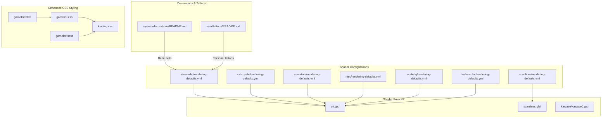
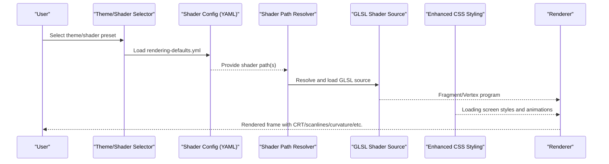
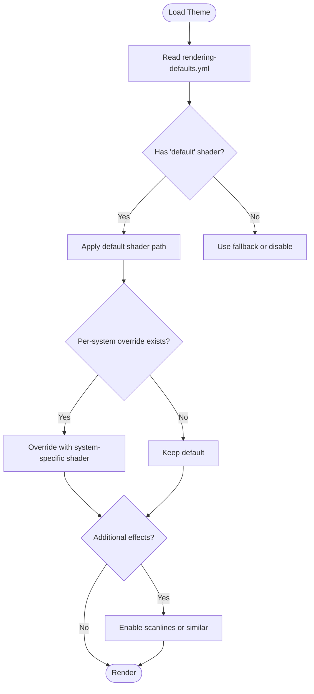
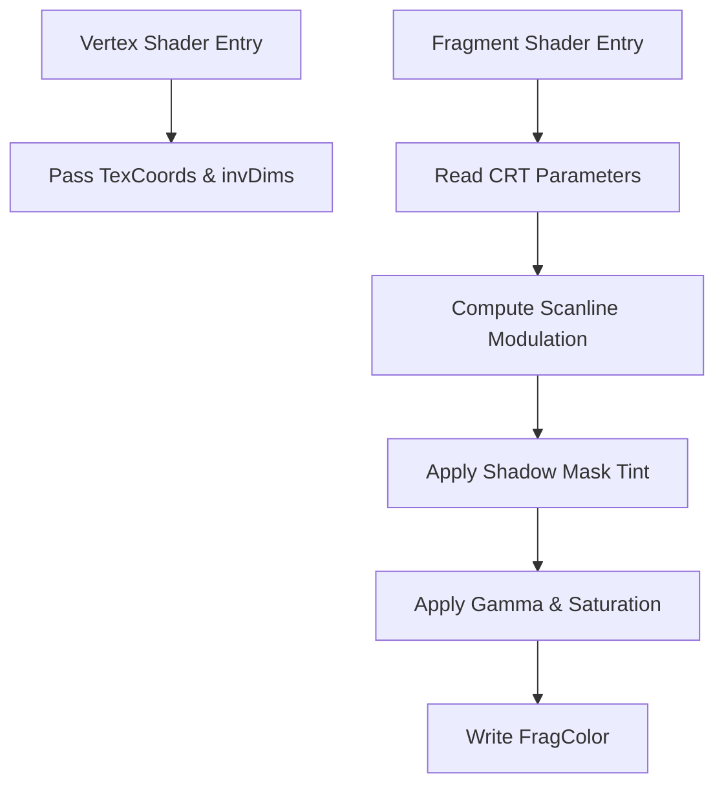
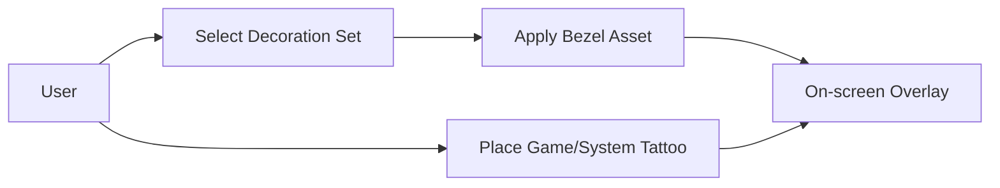
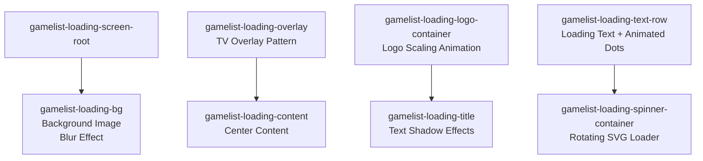
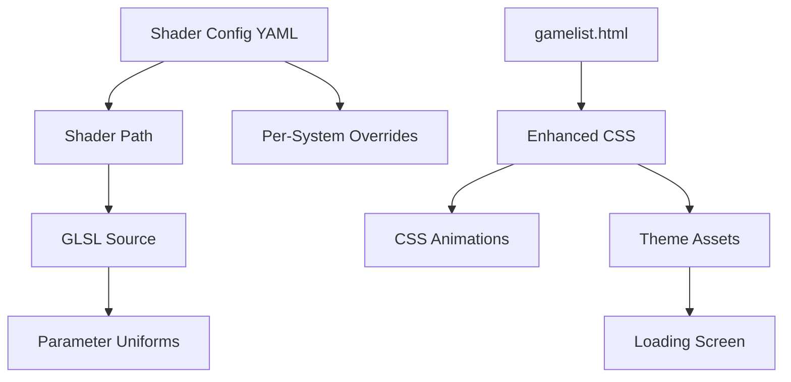

# Visual Customization

<cite>
**Referenced Files in This Document**
- [README.md](file://system/decorations/README.md)
- [README.md](file://user/tattoos/README.md)
- [rendering-defaults.yml](file://system/shaders/configs/[riescade]/rendering-defaults.yml)
- [rendering-defaults.yml](file://system/shaders/configs/crt-royale/rendering-defaults.yml)
- [rendering-defaults.yml](file://system/shaders/configs/curvature/rendering-defaults.yml)
- [rendering-defaults.yml](file://system/shaders/configs/scanlines/rendering-defaults.yml)
- [rendering-defaults.yml](file://system/shaders/configs/ntsc/rendering-defaults.yml)
- [rendering-defaults.yml](file://system/shaders/configs/scalehq/rendering-defaults.yml)
- [rendering-defaults.yml](file://system/shaders/configs/technicolor/rendering-defaults.yml)
- [crt.glsl](file://emulationstation/resources/shaders/crt.glsl)
- [scanlines.glsl](file://emulationstation/resources/shaders/scanlines.glsl)
- [kawase0.glsl](file://emulationstation/resources/shaders/kawase/kawase0.glsl)
- [gamelist.html](file://emulationstation/.riescade/src/src/main/theme_default/gamelist.html)
- [gamelist.css](file://emulationstation/.riescade/src/src/main/theme_default/assets/css/gamelist.css)
- [gamelist.scss](file://emulationstation/.riescade/src/src/main/theme_default/assets/css/scss/gamelist.scss)
- [loading.css](file://emulationstation/.riescade/src/src/main/theme_default/assets/css/loading.css)
- [loading.scss](file://emulationstation/.riescade/src/src/main/theme_default/assets/css/scss/loading.scss)
- [loading_fix.md](file://emulationstation/.riescade/src/.antigravity/loading_fix.md)
</cite>

## Update Summary
**Changes Made**
- Added comprehensive documentation for the enhanced CSS styling system
- Documented the new loading screen overlay system with background images and blur effects
- Added details about animated loading indicators, responsive layouts, and logo containers
- Included information about title text shadow effects and animated dot indicators
- Updated architecture diagrams to reflect the new visual presentation layer
- Added performance considerations for the new loading screen animations

## Table of Contents
1. [Introduction](#introduction)
2. [Project Structure](#project-structure)
3. [Core Components](#core-components)
4. [Architecture Overview](#architecture-overview)
5. [Detailed Component Analysis](#detailed-component-analysis)
6. [Enhanced Loading Screen System](#enhanced-loading-screen-system)
7. [Dependency Analysis](#dependency-analysis)
8. [Performance Considerations](#performance-considerations)
9. [Troubleshooting Guide](#troubleshooting-guide)
10. [Conclusion](#conclusion)
11. [Appendices](#appendices)

## Introduction
This document explains the visual customization system, covering theme management, shader configuration for visual effects, and ambiance settings for different gaming environments. It documents CRT effects, scanlines, curvature, and other enhancements through the shader system, and clarifies how theme files, shader configurations, and decoration assets relate. The system now includes an enhanced CSS styling framework with comprehensive loading screen design and improved visual presentation. Practical examples are drawn from the shader configs directory, and guidance is provided for selecting themes, configuring shader parameters, placing decorations, and optimizing performance across varied hardware.

## Project Structure
The visual customization system spans four primary areas:
- Shader configurations define which shaders are applied per system and environment
- Shader source files implement visual effects such as CRT simulation, scanlines, and blurs
- Decorations and tattoos provide ambient and personalizable overlays
- Enhanced CSS styling system with comprehensive loading screen design

**Diagram sources**
- [rendering-defaults.yml:1-7](file://system/shaders/configs/[riescade]/rendering-defaults.yml#L1-L7)
- [rendering-defaults.yml:1-7](file://system/shaders/configs/crt-royale/rendering-defaults.yml#L1-L7)
- [rendering-defaults.yml:1-91](file://system/shaders/configs/curvature/rendering-defaults.yml#L1-L91)
- [rendering-defaults.yml:1-85](file://system/shaders/configs/scanlines/rendering-defaults.yml#L1-L85)
- [rendering-defaults.yml:1-31](file://system/shaders/configs/ntsc/rendering-defaults.yml#L1-L31)
- [rendering-defaults.yml:1-9](file://system/shaders/configs/scalehq/rendering-defaults.yml#L1-L9)
- [rendering-defaults.yml:1-4](file://system/shaders/configs/technicolor/rendering-defaults.yml#L1-L4)
- [crt.glsl:1-179](file://emulationstation/resources/shaders/crt.glsl#L1-L179)
- [scanlines.glsl:1-77](file://emulationstation/resources/shaders/scanlines.glsl#L1-L77)
- [kawase0.glsl:1-109](file://emulationstation/resources/shaders/kawase/kawase0.glsl#L1-L109)
- [README.md:1-10](file://system/decorations/README.md#L1-L10)
- [README.md:1-11](file://user/tattoos/README.md#L1-L11)
- [gamelist.html:82-115](file://emulationstation/.riescade/src/src/main/theme_default/gamelist.html#L82-L115)
- [gamelist.css:173-308](file://emulationstation/.riescade/src/src/main/theme_default/assets/css/gamelist.css#L173-L308)
- [gamelist.scss:189-321](file://emulationstation/.riescade/src/src/main/theme_default/assets/css/scss/gamelist.scss#L189-L321)
- [loading.css:1-83](file://emulationstation/.riescade/src/src/main/theme_default/assets/css/loading.css#L1-L83)
- [loading.scss:1-88](file://emulationstation/.riescade/src/src/main/theme_default/assets/css/scss/loading.scss#L1-L88)

**Section sources**
- [README.md:1-10](file://system/decorations/README.md#L1-L10)
- [README.md:1-11](file://user/tattoos/README.md#L1-L11)

## Core Components
- Theme selection and shader routing:
  - Shader configs map a "default" shader path and optionally per-system overrides. These paths resolve to shader source files under the shaders directory
- CRT and scanline effects:
  - CRT shaders implement scanline thickness, intensity, brightness boost, mask type, blur, gamma, and saturation controls
  - Scanlines shaders apply alternating dark scanlines and optional saturation adjustments
- Curvature and geometry:
  - Curvature configs route CRT geometry shaders and per-system overrides for handhelds and consoles
- Enhanced CSS styling system:
  - Comprehensive loading screen overlay with background images and blur effects
  - Animated loading indicators with pulse animations and rotating spinners
  - Responsive layouts with logo containers and scalable animations
  - Title text with shadow effects and animated dot indicators
- Ambiance and decoration sets:
  - Official bezel sets are selectable from the UI and organized per system
- Tattoos:
  - Personal PNG tattoos can be placed per game or per system; visible when bezels are enabled

**Section sources**
- [rendering-defaults.yml:1-91](file://system/shaders/configs/curvature/rendering-defaults.yml#L1-L91)
- [rendering-defaults.yml:1-85](file://system/shaders/configs/scanlines/rendering-defaults.yml#L1-L85)
- [crt.glsl:1-179](file://emulationstation/resources/shaders/crt.glsl#L1-L179)
- [scanlines.glsl:1-77](file://emulationstation/resources/shaders/scanlines.glsl#L1-L77)
- [gamelist.scss:189-321](file://emulationstation/.riescade/src/src/main/theme_default/assets/css/scss/gamelist.scss#L189-L321)
- [README.md:1-10](file://system/decorations/README.md#L1-L10)
- [README.md:1-11](file://user/tattoos/README.md#L1-L11)

## Architecture Overview
The visual customization pipeline connects user/system selections to shader execution, CSS styling, and overlay assets.

**Diagram sources**
- [rendering-defaults.yml:1-85](file://system/shaders/configs/scanlines/rendering-defaults.yml#L1-L85)
- [crt.glsl:1-179](file://emulationstation/resources/shaders/crt.glsl#L1-L179)
- [scanlines.glsl:1-77](file://emulationstation/resources/shaders/scanlines.glsl#L1-L77)
- [gamelist.scss:189-321](file://emulationstation/.riescade/src/src/main/theme_default/assets/css/scss/gamelist.scss#L189-L321)

## Detailed Component Analysis

### Theme Management and Shader Routing
- Purpose:
  - Centralize shader selection per theme and per system
- Key behaviors:
  - "default" maps to a primary shader path
  - Per-system keys override the default for specific emulators or rendering backends
  - Some presets enable additional effects such as scanlines
- Examples:
  - A theme preset selects a CRT geometry shader and enables scanlines
  - CRT Royale preset routes a CRT shader for libretro and Ares
  - Curvature preset routes CRT geometry shaders and includes per-system handheld overrides
  - Scanlines preset routes CRT scanlines for many systems and handheld LCD grids for others
  - NTSC preset selects NTSC shaders for DX12/GL and provides Reshader FX mappings
  - ScaleHQ preset selects a high-quality scaling shader and disables it for certain models
  - Technicolor preset applies a film-style color shader

**Diagram sources**
- [rendering-defaults.yml:1-7](file://system/shaders/configs/[riescade]/rendering-defaults.yml#L1-L7)
- [rendering-defaults.yml:1-7](file://system/shaders/configs/crt-royale/rendering-defaults.yml#L1-L7)
- [rendering-defaults.yml:1-91](file://system/shaders/configs/curvature/rendering-defaults.yml#L1-L91)
- [rendering-defaults.yml:1-85](file://system/shaders/configs/scanlines/rendering-defaults.yml#L1-L85)
- [rendering-defaults.yml:1-31](file://system/shaders/configs/ntsc/rendering-defaults.yml#L1-L31)
- [rendering-defaults.yml:1-9](file://system/shaders/configs/scalehq/rendering-defaults.yml#L1-L9)
- [rendering-defaults.yml:1-4](file://system/shaders/configs/technicolor/rendering-defaults.yml#L1-L4)

**Section sources**
- [rendering-defaults.yml:1-7](file://system/shaders/configs/[riescade]/rendering-defaults.yml#L1-L7)
- [rendering-defaults.yml:1-7](file://system/shaders/configs/crt-royale/rendering-defaults.yml#L1-L7)
- [rendering-defaults.yml:1-91](file://system/shaders/configs/curvature/rendering-defaults.yml#L1-L91)
- [rendering-defaults.yml:1-85](file://system/shaders/configs/scanlines/rendering-defaults.yml#L1-L85)
- [rendering-defaults.yml:1-31](file://system/shaders/configs/ntsc/rendering-defaults.yml#L1-L31)
- [rendering-defaults.yml:1-9](file://system/shaders/configs/scalehq/rendering-defaults.yml#L1-L9)
- [rendering-defaults.yml:1-4](file://system/shaders/configs/technicolor/rendering-defaults.yml#L1-L4)

### CRT Effects, Scanlines, Curvature, and Blurs
- CRT shader parameters:
  - Scanline thickness and intensity
  - Luminance boost
  - Shadow mask type and size
  - Blur strength
  - Gamma correction
  - Saturation
- Implementation highlights:
  - Vertex stage passes texture coordinates and inverse dimensions
  - Fragment stage computes scanline modulation, applies mask tinting, gamma, and saturation
- Scanlines shader:
  - Alternating dark scanlines on even rows
  - Optional saturation blending
- Kawase blur:
  - Multi-sample averaging along diagonal offsets for a smooth blur

**Diagram sources**
- [crt.glsl:1-179](file://emulationstation/resources/shaders/crt.glsl#L1-L179)

**Section sources**
- [crt.glsl:1-179](file://emulationstation/resources/shaders/crt.glsl#L1-L179)
- [scanlines.glsl:1-77](file://emulationstation/resources/shaders/scanlines.glsl#L1-L77)
- [kawase0.glsl:1-109](file://emulationstation/resources/shaders/kawase/kawase0.glsl#L1-L109)

### Ambiance Settings and Decoration Assets
- Decoration sets:
  - Official bezel sets are bundled and selectable from the UI
  - Each set includes a fallback bezel and per-system variants
- Tattoos:
  - Users can add per-game or per-system PNG tattoos
  - Tattoos are only shown when bezels are enabled

**Diagram sources**
- [README.md:1-10](file://system/decorations/README.md#L1-L10)
- [README.md:1-11](file://user/tattoos/README.md#L1-L11)

**Section sources**
- [README.md:1-10](file://system/decorations/README.md#L1-L10)
- [README.md:1-11](file://user/tattoos/README.md#L1-L11)

## Enhanced Loading Screen System

### Loading Screen Architecture
The enhanced loading screen system provides a comprehensive visual experience during game list loading with multiple layers and animations.

**Diagram sources**
- [gamelist.scss:190-321](file://emulationstation/.riescade/src/src/main/theme_default/assets/css/scss/gamelist.scss#L190-L321)
- [gamelist.html:82-115](file://emulationstation/.riescade/src/src/main/theme_default/gamelist.html#L82-L115)

### Loading Screen Features
- Background System:
  - Dynamic background images from `{system:theme}.jpg` assets
  - Blur filter with brightness adjustment for optimal contrast
  - Scale transformation for subtle parallax effect
- Overlay System:
  - TV-style overlay pattern for authentic CRT appearance
  - Semi-transparent overlay for visual depth
- Content Layout:
  - Centered content with flexible spacing and alignment
  - Logo container with responsive scaling capabilities
  - Title text with prominent shadow effects
- Loading Indicators:
  - Animated dot indicators with pulse animation
  - Rotating SVG spinner with gradient coloring
  - Theme-aware color schemes using CSS variables

### CSS Animation System
The loading screen implements sophisticated animations for enhanced user experience:

- **riescade-loading-rotate**: Continuous 360-degree rotation for the spinner element
- **riescade-loading-pulse**: Pulsing opacity animation for the loading dots
- **riescade-loading-fade-in**: Smooth fade-in transition for content elements

### Responsive Design Elements
- Flexible container sizing with viewport units (vw/vh)
- Max-width constraints for logos and content areas
- Responsive typography with scalable font sizes
- Adaptive positioning for different screen resolutions

**Section sources**
- [gamelist.html:82-115](file://emulationstation/.riescade/src/src/main/theme_default/gamelist.html#L82-L115)
- [gamelist.css:173-308](file://emulationstation/.riescade/src/src/main/theme_default/assets/css/gamelist.css#L173-L308)
- [gamelist.scss:189-321](file://emulationstation/.riescade/src/src/main/theme_default/assets/css/scss/gamelist.scss#L189-L321)
- [loading.css:1-83](file://emulationstation/.riescade/src/src/main/theme_default/assets/css/loading.css#L1-L83)
- [loading.scss:1-88](file://emulationstation/.riescade/src/src/main/theme_default/assets/css/scss/loading.scss#L1-L88)

## Dependency Analysis
- Theme-to-shader dependency:
  - YAML configs depend on shader source availability under the shaders directory
- Shader-to-parameters dependency:
  - CRT shader depends on parameter uniforms defined in the shader header
- System-specific overrides:
  - Many configs provide per-system overrides for handhelds and specific consoles
- CSS-to-JavaScript dependency:
  - Enhanced loading screen relies on CSS animations and JavaScript-ready HTML structure
- Asset dependency:
  - Loading screen requires theme-specific assets (background images, logos, overlay patterns)

**Diagram sources**
- [rendering-defaults.yml:1-91](file://system/shaders/configs/curvature/rendering-defaults.yml#L1-L91)
- [crt.glsl:1-179](file://emulationstation/resources/shaders/crt.glsl#L1-L179)
- [gamelist.html:82-115](file://emulationstation/.riescade/src/src/main/theme_default/gamelist.html#L82-L115)
- [gamelist.scss:189-321](file://emulationstation/.riescade/src/src/main/theme_default/assets/css/scss/gamelist.scss#L189-L321)

**Section sources**
- [rendering-defaults.yml:1-91](file://system/shaders/configs/curvature/rendering-defaults.yml#L1-L91)
- [crt.glsl:1-179](file://emulationstation/resources/shaders/crt.glsl#L1-L179)

## Performance Considerations
- CRT and scanlines:
  - Scanline modulation and mask tinting add per-pixel computation; adjust intensity and thickness judiciously
- Curvature:
  - Geometry distortion increases vertex and fragment workload; reserve for supported GPUs
- Blurs (e.g., Kawase):
  - Multi-pass blurs increase fragment throughput; reduce pass count or resolution scaling where needed
- Enhanced loading screen:
  - CSS animations are GPU-accelerated but can impact performance on older devices
  - Background image processing and blur filters require sufficient VRAM
  - SVG animations are lightweight but still consume rendering resources
- Resolution scaling:
  - Prefer lower internal resolution or shader-based scaling to maintain frame rate
- Compatibility:
  - Some presets disable shaders for specific models; follow the "disabled" directives to avoid crashes or artifacts
- Recommendations:
  - Profile on target hardware; start with "technicolor" or "scalehq" for balanced quality/performance
  - Disable scanlines or reduce blur/gamma for older GPUs
  - Monitor loading screen performance on low-end devices and consider reducing animation complexity

## Troubleshooting Guide
- No visible CRT effect:
  - Verify the theme's default shader path resolves to an existing GLSL source
  - Confirm per-system overrides are not inadvertently disabling the shader
- Scanlines not appearing:
  - Ensure the scanlines preset is selected and not overridden by a system-specific shader
- Curvature looks distorted:
  - Switch to a geometry shader optimized for the system (e.g., handheld vs console)
- Tattoos not visible:
  - Confirm bezels are enabled; tattoos require bezels to render
- Loading screen issues:
  - Background images failing to load: Check asset paths and ensure `{system:theme}.jpg` files exist
  - Animation performance problems: Disable CSS animations or reduce blur intensity
  - Logo scaling issues: Verify logo assets and CSS max-width constraints
  - Spinner not rotating: Check CSS animation support and JavaScript integration
- Performance drops:
  - Reduce blur strength, disable scanlines, or switch to less demanding presets
  - Consider disabling enhanced loading screen animations on lower-end hardware

**Section sources**
- [rendering-defaults.yml:1-85](file://system/shaders/configs/scanlines/rendering-defaults.yml#L1-L85)
- [rendering-defaults.yml:1-91](file://system/shaders/configs/curvature/rendering-defaults.yml#L1-L91)
- [README.md:1-11](file://user/tattoos/README.md#L1-L11)
- [gamelist.html:82-115](file://emulationstation/.riescade/src/src/main/theme_default/gamelist.html#L82-L115)

## Conclusion
The visual customization system integrates theme-driven shader routing, parameterized CRT and scanline effects, curvature geometry, and blur filters with decoration and tattoo overlays. The enhanced CSS styling system provides a comprehensive loading screen experience with background images, blur effects, animated indicators, and responsive layouts. By leveraging the shader configs, GLSL sources, and enhanced CSS framework documented here, users can tailor visuals to their preferences while balancing performance across diverse hardware configurations.

## Appendices

### Practical Examples and How-To

- Creating a custom CRT theme:
  - Copy an existing CRT preset directory and edit its rendering-defaults.yml to change the default shader path and optionally add per-system overrides
  - Ensure the referenced shader exists under the shaders directory

- Enabling scanlines for a handheld system:
  - Modify the scanlines preset's rendering-defaults.yml to select a handheld LCD grid shader for that system

- Applying curvature to a console:
  - Use the curvature preset's CRT geometry shader; override with a handheld variant if needed

- Creating custom loading screen assets:
  - Prepare theme-specific background images (`{system:theme}.jpg`) for loading screens
  - Create overlay patterns and logo assets in the appropriate asset directories
  - Test loading screen performance on target hardware configurations

- Optimizing performance:
  - Choose "technicolor" or "scalehq" presets; disable scanlines; reduce blur and gamma; lower internal resolution
  - Consider disabling enhanced loading screen animations on lower-end hardware
  - Monitor GPU memory usage when using blur effects and background images