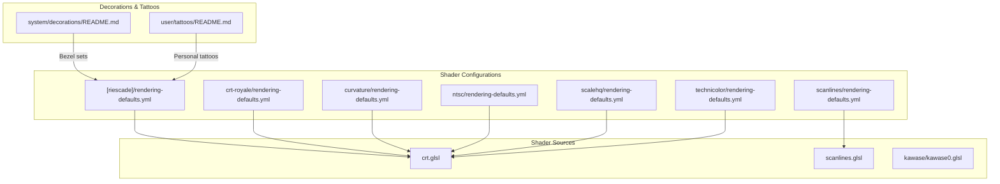
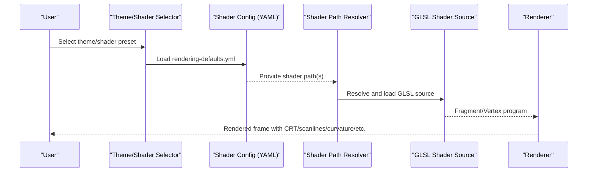
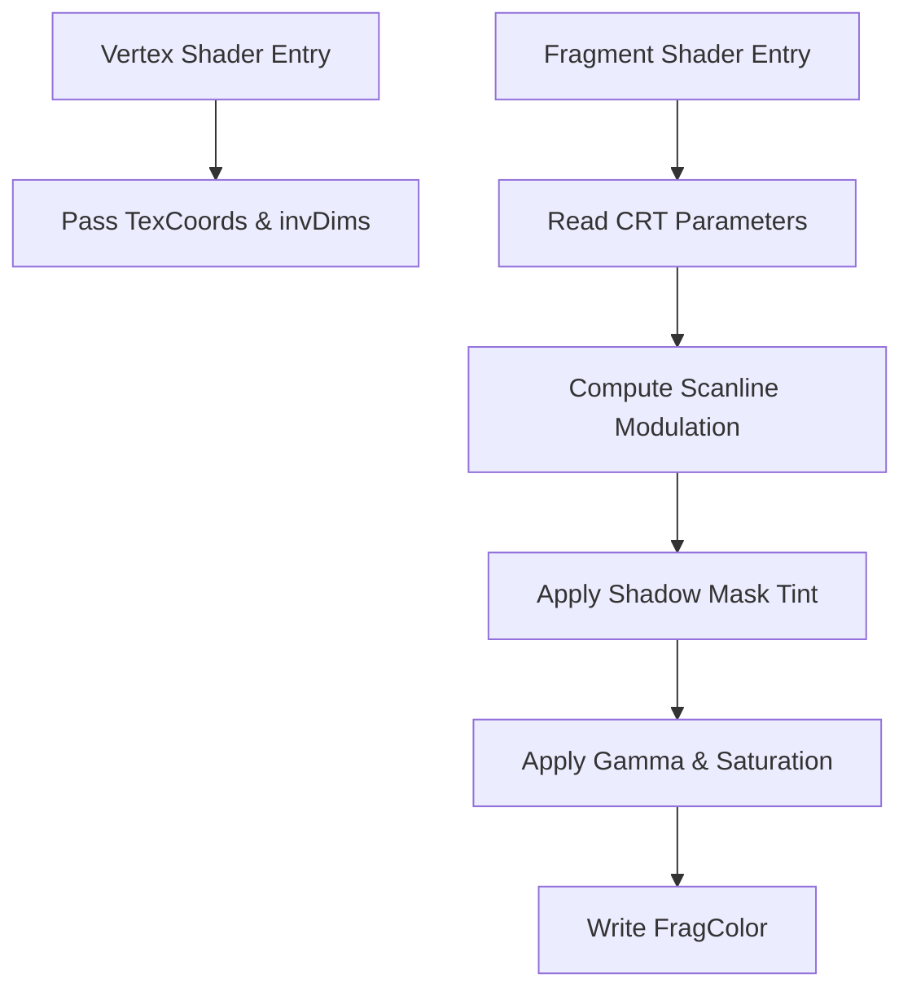
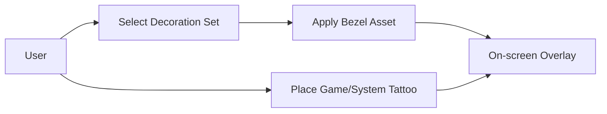
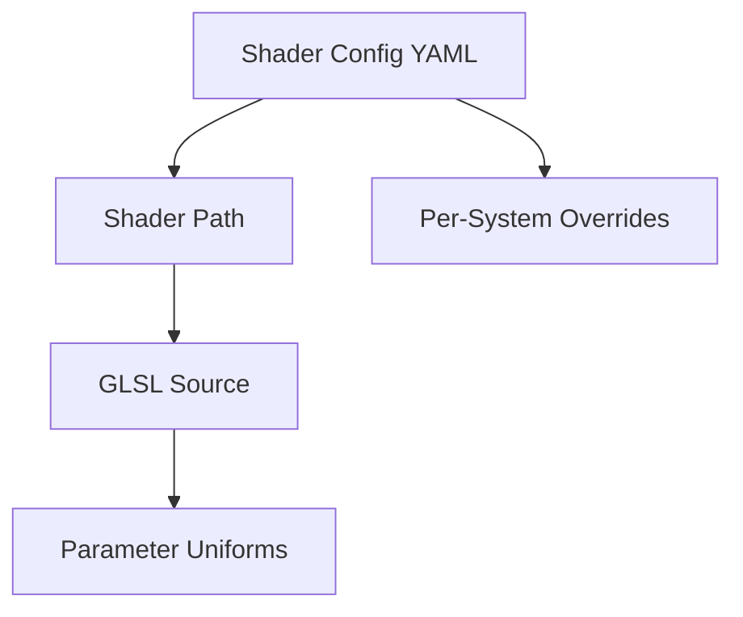

# Visual Customization

<cite>
**Referenced Files in This Document**
- [README.md](file://system/decorations/README.md)
- [README.md](file://user/tattoos/README.md)
- [rendering-defaults.yml](file://system/shaders/configs/[riescade]/rendering-defaults.yml)
- [rendering-defaults.yml](file://system/shaders/configs/crt-royale/rendering-defaults.yml)
- [rendering-defaults.yml](file://system/shaders/configs/curvature/rendering-defaults.yml)
- [rendering-defaults.yml](file://system/shaders/configs/scanlines/rendering-defaults.yml)
- [rendering-defaults.yml](file://system/shaders/configs/ntsc/rendering-defaults.yml)
- [rendering-defaults.yml](file://system/shaders/configs/scalehq/rendering-defaults.yml)
- [rendering-defaults.yml](file://system/shaders/configs/technicolor/rendering-defaults.yml)
- [crt.glsl](file://emulationstation/resources/shaders/crt.glsl)
- [scanlines.glsl](file://emulationstation/resources/shaders/scanlines.glsl)
- [kawase0.glsl](file://emulationstation/resources/shaders/kawase/kawase0.glsl)
</cite>

## Table of Contents
1. [Introduction](#introduction)
2. [Project Structure](#project-structure)
3. [Core Components](#core-components)
4. [Architecture Overview](#architecture-overview)
5. [Detailed Component Analysis](#detailed-component-analysis)
6. [Dependency Analysis](#dependency-analysis)
7. [Performance Considerations](#performance-considerations)
8. [Troubleshooting Guide](#troubleshooting-guide)
9. [Conclusion](#conclusion)
10. [Appendices](#appendices)

## Introduction
This document explains the visual customization system, covering theme management, shader configuration for visual effects, and ambiance settings for different gaming environments. It documents CRT effects, scanlines, curvature, and other enhancements through the shader system, and clarifies how theme files, shader configurations, and decoration assets relate. Practical examples are drawn from the shader configs directory, and guidance is provided for selecting themes, configuring shader parameters, placing decorations, and optimizing performance across varied hardware.

## Project Structure
The visual customization system spans three primary areas:
- Shader configurations define which shaders are applied per system and environment.
- Shader source files implement visual effects such as CRT simulation, scanlines, and blurs.
- Decorations and tattoos provide ambient and personalizable overlays.

**Diagram sources**
- [rendering-defaults.yml:1-7](file://system/shaders/configs/[riescade]/rendering-defaults.yml#L1-L7)
- [rendering-defaults.yml:1-7](file://system/shaders/configs/crt-royale/rendering-defaults.yml#L1-L7)
- [rendering-defaults.yml:1-91](file://system/shaders/configs/curvature/rendering-defaults.yml#L1-L91)
- [rendering-defaults.yml:1-85](file://system/shaders/configs/scanlines/rendering-defaults.yml#L1-L85)
- [rendering-defaults.yml:1-31](file://system/shaders/configs/ntsc/rendering-defaults.yml#L1-L31)
- [rendering-defaults.yml:1-9](file://system/shaders/configs/scalehq/rendering-defaults.yml#L1-L9)
- [rendering-defaults.yml:1-4](file://system/shaders/configs/technicolor/rendering-defaults.yml#L1-L4)
- [crt.glsl:1-179](file://emulationstation/resources/shaders/crt.glsl#L1-L179)
- [scanlines.glsl:1-77](file://emulationstation/resources/shaders/scanlines.glsl#L1-L77)
- [kawase0.glsl:1-109](file://emulationstation/resources/shaders/kawase/kawase0.glsl#L1-L109)
- [README.md:1-10](file://system/decorations/README.md#L1-L10)
- [README.md:1-11](file://user/tattoos/README.md#L1-L11)

**Section sources**
- [README.md:1-10](file://system/decorations/README.md#L1-L10)
- [README.md:1-11](file://user/tattoos/README.md#L1-L11)

## Core Components
- Theme selection and shader routing:
  - Shader configs map a “default” shader path and optionally per-system overrides. These paths resolve to shader source files under the shaders directory.
- CRT and scanline effects:
  - CRT shaders implement scanline thickness, intensity, brightness boost, mask type, blur, gamma, and saturation controls.
  - Scanlines shaders apply alternating dark scanlines and optional saturation adjustments.
- Curvature and geometry:
  - Curvature configs route CRT geometry shaders and per-system overrides for handhelds and consoles.
- Ambiance and decoration sets:
  - Official bezel sets are selectable from the UI and organized per system.
- Tattoos:
  - Personal PNG tattoos can be placed per game or per system; visible when bezels are enabled.

**Section sources**
- [rendering-defaults.yml:1-91](file://system/shaders/configs/curvature/rendering-defaults.yml#L1-L91)
- [rendering-defaults.yml:1-85](file://system/shaders/configs/scanlines/rendering-defaults.yml#L1-L85)
- [crt.glsl:1-179](file://emulationstation/resources/shaders/crt.glsl#L1-L179)
- [scanlines.glsl:1-77](file://emulationstation/resources/shaders/scanlines.glsl#L1-L77)
- [README.md:1-10](file://system/decorations/README.md#L1-L10)
- [README.md:1-11](file://user/tattoos/README.md#L1-L11)

## Architecture Overview
The visual customization pipeline connects user/system selections to shader execution and overlay assets.

**Diagram sources**
- [rendering-defaults.yml:1-85](file://system/shaders/configs/scanlines/rendering-defaults.yml#L1-L85)
- [crt.glsl:1-179](file://emulationstation/resources/shaders/crt.glsl#L1-L179)
- [scanlines.glsl:1-77](file://emulationstation/resources/shaders/scanlines.glsl#L1-L77)

## Detailed Component Analysis

### Theme Management and Shader Routing
- Purpose:
  - Centralize shader selection per theme and per system.
- Key behaviors:
  - “default” maps to a primary shader path.
  - Per-system keys override the default for specific emulators or rendering backends.
  - Some presets enable additional effects such as scanlines.
- Examples:
  - A theme preset selects a CRT geometry shader and enables scanlines.
  - CRT Royale preset routes a CRT shader for libretro and Ares.
  - Curvature preset routes CRT geometry shaders and includes per-system handheld overrides.
  - Scanlines preset routes CRT scanlines for many systems and handheld LCD grids for others.
  - NTSC preset selects NTSC shaders for DX12/GL and provides Reshader FX mappings.
  - ScaleHQ preset selects a high-quality scaling shader and disables it for certain models.
  - Technicolor preset applies a film-style color shader.

**Diagram sources**
- [rendering-defaults.yml:1-7](file://system/shaders/configs/[riescade]/rendering-defaults.yml#L1-L7)
- [rendering-defaults.yml:1-7](file://system/shaders/configs/crt-royale/rendering-defaults.yml#L1-L7)
- [rendering-defaults.yml:1-91](file://system/shaders/configs/curvature/rendering-defaults.yml#L1-L91)
- [rendering-defaults.yml:1-85](file://system/shaders/configs/scanlines/rendering-defaults.yml#L1-L85)
- [rendering-defaults.yml:1-31](file://system/shaders/configs/ntsc/rendering-defaults.yml#L1-L31)
- [rendering-defaults.yml:1-9](file://system/shaders/configs/scalehq/rendering-defaults.yml#L1-L9)
- [rendering-defaults.yml:1-4](file://system/shaders/configs/technicolor/rendering-defaults.yml#L1-L4)

**Section sources**
- [rendering-defaults.yml:1-7](file://system/shaders/configs/[riescade]/rendering-defaults.yml#L1-L7)
- [rendering-defaults.yml:1-7](file://system/shaders/configs/crt-royale/rendering-defaults.yml#L1-L7)
- [rendering-defaults.yml:1-91](file://system/shaders/configs/curvature/rendering-defaults.yml#L1-L91)
- [rendering-defaults.yml:1-85](file://system/shaders/configs/scanlines/rendering-defaults.yml#L1-L85)
- [rendering-defaults.yml:1-31](file://system/shaders/configs/ntsc/rendering-defaults.yml#L1-L31)
- [rendering-defaults.yml:1-9](file://system/shaders/configs/scalehq/rendering-defaults.yml#L1-L9)
- [rendering-defaults.yml:1-4](file://system/shaders/configs/technicolor/rendering-defaults.yml#L1-L4)

### CRT Effects, Scanlines, Curvature, and Blurs
- CRT shader parameters:
  - Scanline thickness and intensity
  - Luminance boost
  - Shadow mask type and size
  - Blur strength
  - Gamma correction
  - Saturation
- Implementation highlights:
  - Vertex stage passes texture coordinates and inverse dimensions.
  - Fragment stage computes scanline modulation, applies mask tinting, gamma, and saturation.
- Scanlines shader:
  - Alternating dark scanlines on even rows.
  - Optional saturation blending.
- Kawase blur:
  - Multi-sample averaging along diagonal offsets for a smooth blur.

**Diagram sources**
- [crt.glsl:1-179](file://emulationstation/resources/shaders/crt.glsl#L1-L179)

**Section sources**
- [crt.glsl:1-179](file://emulationstation/resources/shaders/crt.glsl#L1-L179)
- [scanlines.glsl:1-77](file://emulationstation/resources/shaders/scanlines.glsl#L1-L77)
- [kawase0.glsl:1-109](file://emulationstation/resources/shaders/kawase/kawase0.glsl#L1-L109)

### Ambiance Settings and Decoration Assets
- Decoration sets:
  - Official bezel sets are bundled and selectable from the UI.
  - Each set includes a fallback bezel and per-system variants.
- Tattoos:
  - Users can add per-game or per-system PNG tattoos.
  - Tattoos are only shown when bezels are enabled.

**Diagram sources**
- [README.md:1-10](file://system/decorations/README.md#L1-L10)
- [README.md:1-11](file://user/tattoos/README.md#L1-L11)

**Section sources**
- [README.md:1-10](file://system/decorations/README.md#L1-L10)
- [README.md:1-11](file://user/tattoos/README.md#L1-L11)

## Dependency Analysis
- Theme-to-shader dependency:
  - YAML configs depend on shader source availability under the shaders directory.
- Shader-to-parameters dependency:
  - CRT shader depends on parameter uniforms defined in the shader header.
- System-specific overrides:
  - Many configs provide per-system overrides for handhelds and specific consoles.

**Diagram sources**
- [rendering-defaults.yml:1-91](file://system/shaders/configs/curvature/rendering-defaults.yml#L1-L91)
- [crt.glsl:1-179](file://emulationstation/resources/shaders/crt.glsl#L1-L179)

**Section sources**
- [rendering-defaults.yml:1-91](file://system/shaders/configs/curvature/rendering-defaults.yml#L1-L91)
- [crt.glsl:1-179](file://emulationstation/resources/shaders/crt.glsl#L1-L179)

## Performance Considerations
- CRT and scanlines:
  - Scanline modulation and mask tinting add per-pixel computation; adjust intensity and thickness judiciously.
- Curvature:
  - Geometry distortion increases vertex and fragment workload; reserve for supported GPUs.
- Blurs (e.g., Kawase):
  - Multi-pass blurs increase fragment throughput; reduce pass count or resolution scaling where needed.
- Resolution scaling:
  - Prefer lower internal resolution or shader-based scaling to maintain frame rate.
- Compatibility:
  - Some presets disable shaders for specific models; follow the “disabled” directives to avoid crashes or artifacts.
- Recommendations:
  - Profile on target hardware; start with “technicolor” or “scalehq” for balanced quality/performance.
  - Disable scanlines or reduce blur/gamma for older GPUs.

[No sources needed since this section provides general guidance]

## Troubleshooting Guide
- No visible CRT effect:
  - Verify the theme’s default shader path resolves to an existing GLSL source.
  - Confirm per-system overrides are not inadvertently disabling the shader.
- Scanlines not appearing:
  - Ensure the scanlines preset is selected and not overridden by a system-specific shader.
- Curvature looks distorted:
  - Switch to a geometry shader optimized for the system (e.g., handheld vs console).
- Tattoos not visible:
  - Confirm bezels are enabled; tattoos require bezels to render.
- Performance drops:
  - Reduce blur strength, disable scanlines, or switch to less demanding presets.

**Section sources**
- [rendering-defaults.yml:1-85](file://system/shaders/configs/scanlines/rendering-defaults.yml#L1-L85)
- [rendering-defaults.yml:1-91](file://system/shaders/configs/curvature/rendering-defaults.yml#L1-L91)
- [README.md:1-11](file://user/tattoos/README.md#L1-L11)

## Conclusion
The visual customization system integrates theme-driven shader routing, parameterized CRT and scanline effects, curvature geometry, and blur filters with decoration and tattoo overlays. By leveraging the shader configs and GLSL sources documented here, users can tailor visuals to their preferences while balancing performance across diverse hardware.

[No sources needed since this section summarizes without analyzing specific files]

## Appendices

### Practical Examples and How-To

- Creating a custom CRT theme:
  - Copy an existing CRT preset directory and edit its rendering-defaults.yml to change the default shader path and optionally add per-system overrides.
  - Ensure the referenced shader exists under the shaders directory.

- Enabling scanlines for a handheld system:
  - Modify the scanlines preset’s rendering-defaults.yml to select a handheld LCD grid shader for that system.

- Applying curvature to a console:
  - Use the curvature preset’s CRT geometry shader; override with a handheld variant if needed.

- Optimizing performance:
  - Choose “technicolor” or “scalehq” presets; disable scanlines; reduce blur and gamma; lower internal resolution.

[No sources needed since this section provides general guidance]